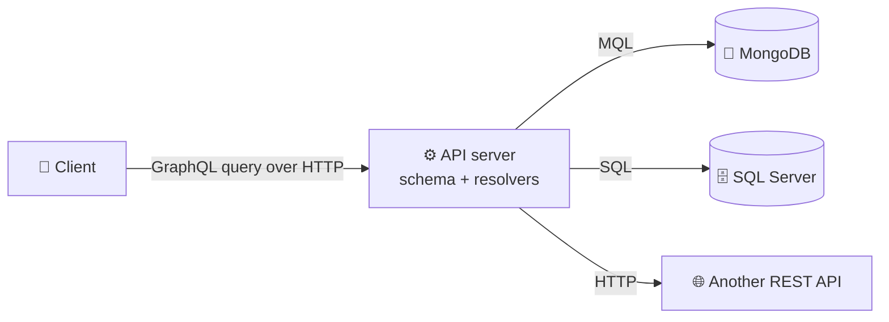

# APIs · GraphQL — a slow, example-first walkthrough

> The third API style of Month 2, and the most polarized. Even-handed view: it solves **two** real
> problems and introduces **four** new ones.
>
> **Where this sits:** Technology `APIs & HTTP` → Main topic `GraphQL` → Sub topic `Basics`.
> Prerequisites: [`../../Http/Fundamentals/HttpFundamentals.md`](../../Http/Fundamentals/HttpFundamentals.md) ·
> [`../../Rest/Design/RestDesign.md`](../../Rest/Design/RestDesign.md).
> Runnable code: [`FetchComparison.cs`](FetchComparison.cs) · [`ResolverEngine.cs`](ResolverEngine.cs) ·
> [`QueryGuard.cs`](QueryGuard.cs) · [`GraphQlDemo.cs`](GraphQlDemo.cs).

---

## 0. First: GraphQL is not a database
A common confusion, because both use nested JSON-ish syntax. They're in **different tiers**:

| | **GraphQL** | **MongoDB** |
|---|---|---|
| What it is | an **API query language** + runtime | a **NoSQL database** |
| Stores data? | ❌ none at all | ✅ on disk |
| Runs where | your API server | a database server |
| Called by | **client apps** | **your backend code** |
| Replaces | REST / gRPC | SQL Server / Cosmos |



> 🧠 **MongoDB is the warehouse; GraphQL is the order form at the counter.** One GraphQL schema can be
> served from several databases and APIs at once.
>
> ⚠️ And GraphQL is **not** "database queries exposed to clients" — clients may only request what your
> **schema** exposes, resolved by **your code** (where auth and business rules live).

## 1. WHY it exists — two REST pain points

### Over-fetching
`GET /products` returns **25 fields**; your list screen needs **2**. You paid for 23 fields of bandwidth
and serialization.

### Under-fetching (the request waterfall)
```
GET /users/1          → then
GET /users/1/orders   → then, for each of 10 orders…
GET /orders/{id}/items  → 10 more requests        = 12 SEQUENTIAL round trips
```
Each step depends on the previous, so they can't be parallelised.

| Problem | Meaning | Symptom |
|---|---|---|
| **Over-fetching** | responses carry **too much** | wasted bytes |
| **Under-fetching** | responses carry **too little** | wasted **round trips** |

> 🧠 **Round trips cost far more than bytes.** At ~200 ms mobile latency, 12 sequential requests is
> ~2.4 s of pure waiting — bandwidth doesn't help.

REST's escape hatches (`?fields=`, `?include=`, a `/mobile/dashboard` endpoint, a BFF) all work, but
each new screen adds an endpoint. Two years later you maintain fourteen near-identical ones.
*(Note: adding an endpoint is **additive**, so it never needs a new version — see §3.2.)*

## 2. WHAT — a query language plus a runtime
**One endpoint** (`POST /graphql`). The client sends a query; **the response mirrors its shape**.

```graphql
query {
  user(id: 1) {
    name
    avatar
    orders { total items { product } }
  }
}
```
```graphql
type User  { id: ID!  name: String!  avatar: String  orders: [Order!]! }   # ! = non-nullable
type Query        { user(id: ID!): User }
type Mutation     { createOrder(input: CreateOrderInput!): Order! }
type Subscription { orderUpdated(id: ID!): Order! }
```
Three operations: **Query** (read), **Mutation** (write), **Subscription** (real-time). Behind each
field sits a **resolver** — a function that fetches that piece.

### The month's three styles side by side
| | REST | gRPC | GraphQL |
|---|---|---|---|
| **Contract** | OpenAPI (often after the fact) | **`.proto`, generates code** | **schema (SDL), introspectable** |
| **Shape decided by** | server | server | **client** ⭐ |
| **Endpoints** | many | many methods | **one** |
| **Format** | JSON | binary | JSON |

## 3. The costs — the honest part

### ☠️ The N+1 problem
10 orders, each with a customer → **1 + 10 = 11 queries**, because each resolver runs independently and
can't see its siblings. Nesting makes it multiplicative: 10 orders × 5 items with a product each = **61**.

**Fix: batching.** Collect the ids requested in one tick, issue `WHERE Id IN (...)` → **11 → 2**. That's
**DataLoader**, built into **Hot Chocolate** in .NET. *(Same problem you may know from EF Core lazy
loading in a loop — GraphQL just makes it very easy to trigger.)*

> 🧠 **GraphQL without DataLoader will quietly hammer your database.** Batching is table stakes, not an
> optimization for later.

### Caching is genuinely harder
Every request is a `POST` to one URL → **no HTTP caching** (no CDN, proxy, or browser cache by URL).
Compensate with **persisted queries** (register queries ahead, call by hash, enabling `GET` + caching)
and normalized client caches (Apollo/Relay). You gave up something REST had for free.

### Query cost is an attack surface
```graphql
{ user { orders { customer { orders { customer { orders { … } } } } } } }
```
A tiny request can explode into millions of resolver calls — a **denial-of-service** surface, and a
buggy client triggers it as easily as an attacker.

> 🧠 **REST endpoints have naturally bounded cost — the *server* decides. GraphQL hands that control to
> the *client*,** so you must hand-build the limits REST gave you free:

| Protection | What it does |
|---|---|
| **Depth limiting** | reject nesting deeper than ~10 |
| **Complexity / cost analysis** ⭐ | cost × list sizes, rejected over budget |
| **Pagination caps** | clamp `first:` — depth limits don't stop `first: 1000000` |
| **Timeouts + rate limiting** | bound execution and per-client volume |
| **Persisted queries / allow-list** | strongest: only pre-registered queries may run |

Hot Chocolate ships all of these — but they're **opt-in**. A default server is wide open.

### Errors return `200 OK`
Exactly the pattern criticized in §3.1 — but for a defensible reason: **partial success**.
```json
{ "data":   { "user": { "name": "Alice", "orders": null } },
  "errors": [ { "message": "orders service unavailable", "path": ["user","orders"] } ] }
```
No single HTTP status describes "half of this worked". `200` describes the **transport**; the body
describes the **per-field outcomes**. The cost is yours to carry: monitoring, retry policies and circuit
breakers all see success.

> 🧠 **REST: status = outcome. GraphQL: status = transport, body = outcome.** Run GraphQL while
> monitoring only HTTP status codes and you are effectively blind. Track **GraphQL error rate as its own
> metric**.

### Versioning: evolution instead of versions
GraphQL discourages `/v2`: add fields, mark old ones `@deprecated(reason: "use fullName")`, and — because
you can see **exactly which clients request which fields** — you know precisely when removal is safe.
That's §3.2's **expand → migrate → contract** with **built-in telemetry**.

## 4. WHEN
| Use **GraphQL** | Use **REST** | Use **gRPC** |
|---|---|---|
| many **diverse clients** needing different shapes | public/partner APIs, simple CRUD | internal service-to-service |
| deeply **related data** in one view | HTTP caching matters | max performance, streaming |
| endpoint proliferation already hurts | small team, simple needs | strict contracts, polyglot |

> 🧠 **GraphQL is a client-experience optimization paid for with server-side complexity.** With one
> client and simple data, REST is the better *engineering* decision — saying so isn't old-fashioned.
> "Mobile" is only a proxy for the real criteria: **many diverse clients**, **related data**, **endpoint
> sprawl**.

## 5. The runnable model in this repo
```powershell
dotnet run --project src/BackendArchitect -c Release
```
```
OVER-fetching — a list screen needing 2 of 25 fields:
  REST    (server decides the shape):  25000 bytes
  GraphQL (client decides the shape):   2000 bytes  -> 92% less

UNDER-fetching — user + 10 orders + the items of each order:
  REST    : 12 sequential round trips -> ~2400 ms on mobile
  GraphQL :  1 round trip             -> ~200 ms

N+1 on the server (10 orders, each with a customer):
  naive resolvers  : 11 queries  <- 1 + N
  with DataLoader  : 2 queries
  nested (10 orders x 5 items): 61 queries unbatched

Query limits:
  ALLOW  normal query       depth 3, complexity 100 - within budget
  REJECT deeply nested      depth 25 exceeds the limit of 10
  REJECT shallow but huge   page size 1000000 exceeds the limit of 100
  REJECT cost explosion     complexity 125000 exceeds the budget of 1000
```

Note the third rejection: **depth limiting alone is not enough** — a *shallow* query asking for a
million rows is just as damaging.

---

## Recap in one breath
GraphQL lets the **client** specify exactly the shape it needs from **one endpoint**, fixing REST's
**over-fetching** (too many bytes) and **under-fetching** (too many round trips). The price: the **N+1
problem** (fix with **DataLoader** batching), **no HTTP caching**, **client-controlled query cost**
(needs depth + complexity + pagination limits), and **errors inside a `200`** (needs its own metric).
Worth it with **many diverse clients over related data** — not for a single client doing simple CRUD.

## Warm-up questions
1. Over-fetching vs under-fetching — define each and say which hurts more on mobile.
2. Why does 10 orders with a customer each cost 11 queries, and how do you get it to 2?
3. Why isn't depth limiting sufficient on its own?
4. Why does GraphQL return `200` with errors — and what must you do because of it?
5. Your team has one web client and 8 CRUD entities. GraphQL or REST? Defend it.
6. How is GraphQL different from MongoDB?
