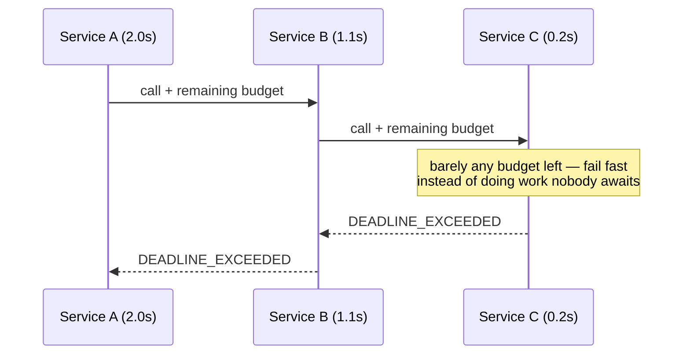

# APIs · gRPC — a slow, example-first walkthrough

> A deliberate contrast with REST: gRPC drops the resource model and goes back to **calling functions**.
>
> **Where this sits:** Technology `APIs & HTTP` → Main topic `gRPC` → Sub topic `Contracts`.
> Prerequisites: [`../../Http/Fundamentals/HttpFundamentals.md`](../../Http/Fundamentals/HttpFundamentals.md) ·
> [`../../Rest/Design/RestDesign.md`](../../Rest/Design/RestDesign.md).
> Runnable code: [`ProtoSchema.cs`](ProtoSchema.cs) · [`ProtoCodec.cs`](ProtoCodec.cs) ·
> [`DeadlineBudget.cs`](DeadlineBudget.cs) · [`GrpcDemo.cs`](GrpcDemo.cs).

---

## 1. WHAT — contract-first RPC over HTTP/2

**One sentence:** you define the service in a **`.proto` file**, gRPC **generates** client and server
code, and they exchange **binary Protocol Buffers** over **HTTP/2**.

| | REST | gRPC |
|---|---|---|
| **You think in** | resources (nouns) | **methods (verbs)** |
| **You write** | `GET /orders/5` | `GetOrder(id: 5)` |
| **Contract** | docs / OpenAPI (often written after) | **the `.proto` — code is generated from it** |
| **Format** | JSON (text) | **protobuf (binary)** |
| **Transport** | usually HTTP/1.1 | **HTTP/2 always** |

> 🧠 REST asks *"what things do I have?"* gRPC asks *"what operations do I expose?"*

```proto
syntax = "proto3";

service OrderService {
  rpc GetOrder     (GetOrderRequest) returns (Order);
  rpc WatchOrders  (WatchRequest)    returns (stream OrderUpdate);
}

message Order {
  int32  id       = 1;      // ← these NUMBERS are the real contract
  string customer = 2;
  double total    = 3;
}
```

### The four call types
| Type | Shape | Use for |
|---|---|---|
| **Unary** | 1 → 1 | normal call: `GetOrder(5)` |
| **Server streaming** | 1 → many | live dashboards, price feeds, tailing logs |
| **Client streaming** | many → 1 | bulk upload, telemetry batches |
| **Bidirectional** | many ↔ many | chat, interactive sessions |

### Why it's fast — three compounding reasons
1. **Binary protobuf** — no field names, no quotes/braces on the wire. Typically **30–50% smaller** than
   JSON and much cheaper to parse.
2. **HTTP/2** — one persistent connection, **multiplexed** (many concurrent calls, no head-of-line
   blocking), header compression.
3. **Code generation** — no hand-written clients, no serializer mismatches; contract drift becomes a
   *compile error*.

Plus **its own status codes** (`OK`, `NOT_FOUND`, `INVALID_ARGUMENT`, `UNAVAILABLE`,
`DEADLINE_EXCEEDED`) and **first-class deadlines** (below).

## 2. WHY protobuf's compatibility story beats JSON's

**Field names never travel over the wire — only field numbers do.**

```
JSON on the wire:      {"id":5,"customer":"Alice"}     ← the NAME is part of the data
protobuf on the wire:  [1]=5  [2]="Alice"              ← only the NUMBER identifies the field
```

This **inverts the JSON intuition** you built in [REST versioning](../../Rest/Design/RestDesign.md):

| Change | JSON/REST | protobuf |
|---|---|---|
| **Rename** a field | ❌ breaking (silent `null`) | ✅ **free** |
| **Add** a field | ✅ free | ✅ free (unknown numbers ignored) |
| **Change the field number** | n/a | ❌ **breaking** |
| **Change the type** | ❌ breaking | ❌ breaking |
| **Reuse a retired number** | n/a | ☠️ **silent data corruption** |

> 🧠 **In JSON the name is the contract; in protobuf the number is.** Compatibility becomes *structural*
> rather than a matter of discipline — the thing you're most tempted to change casually (the name) is
> exactly the thing that's free.

### ☠️ Never reuse a retired field number
Delete field `3`, and six months later someone assigns `3` to a new `int32`. An old client still
believes `3` is a `string` — so it decodes those bytes with the **old meaning**. Not an error:
**misinterpretation**. Garbage values, silently.

```proto
message Order {
  reserved 3;             // nobody may ever use this number again
  reserved "status";      // ...nor the old name
  int32  id       = 1;
  string customer = 2;
  double total    = 4;    // next new field takes 4, not 3
}
```
Now the **compiler** enforces it instead of a code reviewer.

> 🧠 **Delete a field → immediately `reserved` its number.** It's the protobuf equivalent of never
> reusing a primary key.

## 3. Deadlines — a budget for the whole call tree

A gRPC deadline **propagates as a shrinking budget**, rather than each service starting a fresh timer:

```
A receives request      deadline = now + 2.0s
A calls B               "you have 1.6s left"
B calls C               "you have 1.2s left"
```

| | Independent 2s timeouts | Propagated 2s deadline |
|---|---|---|
| **Worst-case total** | 2 + 2 + 2 = **6s** | **2s**, guaranteed |
| **After the caller gives up** | B and C **keep working** | everyone stops together |
| **Before starting work** | can't tell if it's worth it | "0.1s left — fail fast" |

That middle row is the real win: **zombie work**. Without propagation, A times out and returns an error,
while B still queries the database and C burns CPU producing a result **nobody will read**. Under load
that's how one slow dependency cascades into collapse.

> 🧠 **A deadline is a budget for the whole call tree, not a timer per service.** HTTP has no equivalent —
> this is a genuine gRPC advantage, and the bridge into §6.2 resilience.

## 4. WHEN — the honest comparison

| Use **gRPC** when | Use **REST** when |
|---|---|
| **internal service-to-service** | **public / partner** APIs |
| high throughput, low latency | browser clients |
| **streaming** | you need HTTP caching (CDN, proxies) |
| polyglot teams sharing one contract | humans must debug with `curl` |
| strict contracts matter | zero-friction adoption matters |

Honest costs of gRPC: **browsers can't speak it natively** (gRPC-Web needs a proxy and drops client/bidi
streaming), **not human-readable** (needs `grpcurl`), **no HTTP caching**, and **adoption friction** for
third parties who expect a URL and a JSON example.

> 🧠 **REST at the edge, gRPC between services** — optimize the outside for *reach*, the inside for
> *efficiency*.

⚠️ **Browser push:** server streaming works over gRPC-Web, but for a browser dashboard most .NET teams
use **SignalR** (or WebSockets/SSE) instead — purpose-built, no proxy, automatic transport fallback.
Knowing when *not* to use the shiny thing is the skill.

## 5. The runnable model in this repo

```powershell
dotnet run --project src/BackendArchitect -c Release
```
```
A v2 server responds; a v1 client decodes it:
    customer      = Alice
    id            = 5
    total         = 9.75
  -> 'customer' still resolves (field 2), 'currency' (field 4) is ignored
  -> renaming is FREE: names never travel, only numbers do

Payload size: protobuf ~24 bytes vs JSON 61 bytes (61% smaller)

Retiring field 3 and reserving its number:
  compiler refuses: field number 3 is reserved and must never be reused

A 2s deadline propagating through A -> B -> C (each takes 0.9s):
  A: arrived with 2.0s, worked=True  OK
  B: arrived with 1.1s, worked=True  OK
  C: arrived with 0.2s, worked=True  DEADLINE_EXCEEDED while working
  independent 2s timeouts would allow up to 6.0s total
```



---

## Recap in one breath
gRPC is **contract-first RPC**: a `.proto` generates typed clients/servers, exchanging **binary
protobuf** over **HTTP/2** — smaller, faster, and with four call types including **streaming**. Its
compatibility rules invert JSON's because **only field numbers travel**: **renaming is free**,
**renumbering breaks**, and **reusing a retired number corrupts data** (so always `reserved` it).
**Deadlines propagate as a shrinking budget**, preventing zombie work. Use **gRPC inside, REST at the
edge**.

## Warm-up questions
1. Why is renaming a protobuf field free when renaming a JSON field is breaking?
2. What happens if you reuse a deleted field's number — and what prevents it?
3. How does a propagated deadline differ from a per-service timeout? What does it prevent?
4. Give two concrete reasons not to expose gRPC as your public API.
5. Which call type suits a live dashboard, and what's the catch in a browser?
