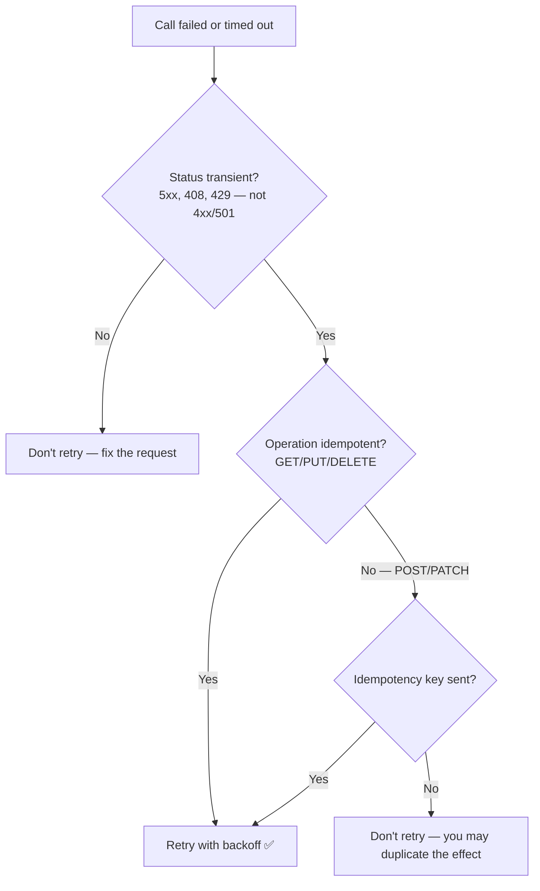

# APIs · HTTP · Fundamentals — a slow, example-first walkthrough

> **First topic of Month 2.** REST is conventions *on top of* HTTP, gRPC runs *over* HTTP/2, and every
> resilience pattern is about *what to do when an HTTP call misbehaves*. Get this right and the rest of
> the month is much easier.
>
> **Where this sits:** Technology `APIs & HTTP` → Main topic `HTTP` → Sub topic `Fundamentals`.
> Runnable code: [`HttpSemantics.cs`](HttpSemantics.cs) · [`IdempotentPaymentApi.cs`](IdempotentPaymentApi.cs) ·
> [`HttpFundamentalsDemo.cs`](HttpFundamentalsDemo.cs).

---

## 1. WHO — who cares?
- **Who needs it:** every backend engineer — it's the protocol under your APIs, your service-to-service
  calls, and every SDK you use.
- **The trap:** nearly everyone knows *enough* HTTP to be dangerous (`GET`, `POST`, `200`, `404`) and
  then designs APIs that misuse status codes, break caching, and can't be retried safely.

> 🧠 HTTP isn't just "how data travels" — it's a **contract** that browsers, proxies, CDNs, load
> balancers, crawlers and retry libraries all rely on. Break the rules and *their* behaviour breaks.

## 2. WHAT — the two properties that decide everything

**Safe** — the method doesn't change server state (read-only).
**Idempotent** — calling it N times has the same effect as calling it once.

| Method | Safe | Idempotent | Meaning |
|---|:--:|:--:|---|
| **GET** | ✅ | ✅ | read a resource |
| **HEAD** | ✅ | ✅ | like GET, headers only |
| **PUT** | ❌ | ✅ | **replace** at a known URL |
| **DELETE** | ❌ | ✅ | remove — deleting twice leaves it just as deleted |
| **POST** | ❌ | ❌ | create/submit — **twice creates two things** |
| **PATCH** | ❌ | ⚠️ usually not | partial update |

> 🧠 **`PUT /orders/5` twice = one order. `POST /orders` twice = two orders.** That sentence is why a
> timeout on a `POST` is dangerous — and every safe method is automatically idempotent too.

### Choosing a method
| Situation | Method |
|---|---|
| Create, **server** assigns the id | `POST /customers` |
| Create/replace at a URL **you** know | `PUT /customers/10` |
| Change **some** fields | `PATCH /customers/10` |
| Remove | `DELETE /customers/10` |

⚠️ **PUT replaces the whole resource.** Omit a field and it should be **cleared**, not left alone. Using
`PUT` with partial-update behaviour is a common bug — clients can't predict what happens to omitted fields.

### ☠️ Why you must never hide a state change behind GET
`GET` is a **promise to the entire internet that nothing changes**, so machines call it uninvited:
search-engine **crawlers**, **browser prefetch**, **link-preview bots** (Slack/Teams unfurling a pasted
URL), **security scanners**, **caches**, and plain **F5**.

There's a well-known cautionary tale: an admin tool used `GET` links for delete; someone installed a
browser accelerator that **pre-fetched every link on the page** and walked the admin panel deleting
records. Nobody clicked anything. Also, URLs are **logged everywhere** (proxies, server logs, history),
so `?id=5` leaks — and `GET` responses are **cacheable**, so a proxy may serve a cached "success"
without ever reaching you.

## 3. WHY — status codes are read by machines

Returning `200 OK` with `{"error": "not found"}` lies to every piece of infrastructure in the path:

| Who reads the status | What breaks with a fake `200` |
|---|---|
| Your monitoring | dashboards show **100% success** while everything fails |
| Retry policies (Polly, SDKs) | won't retry — they saw success |
| Caches / CDNs | cache the "error" as a valid response |
| Client libraries | won't throw; the error slips silently into your code |
| Load balancers | keep routing to an unhealthy instance |

> 🧠 **The status code is the machine-readable summary; the body is the human-readable detail.**

| Range | Meaning | Whose fault |
|---|---|---|
| **2xx** | success | — |
| **3xx** | redirection | — |
| **4xx** | **client** error — the request was wrong | the caller's |
| **5xx** | **server** error — the request was fine, the server failed | the server's |

For error bodies there's a standard: **RFC 9457 Problem Details** (`application/problem+json`), which
ASP.NET Core emits out of the box.

## 4. HOW — retry decisions

| Code | Retry? | Why |
|---|:--:|---|
| **4xx** generally | ❌ | *you're* wrong — retrying changes nothing |
| **429** Too Many Requests | ✅ | the 4xx that **is** retryable — back off first *(cf. Cosmos throttling)* |
| **408** Request Timeout | ✅ | transient |
| **5xx** generally | ✅ | transient server trouble |
| **501** Not Implemented | ❌ | the 5xx that **won't** fix itself |

> 🧠 **4xx = fix your request. 5xx = try again later.** With `429` and `501` as the exceptions.

**But the status code alone is not enough:**

> ### Retry safety = (is the status transient?) **AND** (is the operation idempotent?)

A `503` on `PUT /customers/10` → retry freely. A `503` on `POST /payments` → **you still risk a double
charge**, because a timeout is *ambiguous*:

| What actually happened | Retry safe? |
|---|---|
| Request never reached the server | ✅ |
| Server got it, crashed before charging | ✅ |
| Server charged, **response lost in transit** | ❌ double charge |
| Server charged, response arrived after your timeout | ❌ double charge |

> 🧠 **A timeout is not a failure — it's an unknown.**

### The fix: idempotency keys
"Query first, then retry" is *not* enough — it's **check-then-act**, the same race as the ticket-booth
oversell in [isolation levels](../../../Databases/SQL/IsolationLevels/IsolationLevels.md): the original
request can still land in the gap. (And you often have no server-generated id to query by.)

Instead, the **client** generates a unique key **once per logical operation** and resends it on every
attempt:

```http
POST /payments
Idempotency-Key: 7f3c9a1e-4b2d-4c8a-9f11-2e6d5b8c1a04
{ "amount": 100.00, "customer": "alice" }
```
Server: **key seen?** → return the **stored original response**, don't charge again.
**New key?** → charge and store `(key → result)` **in the same transaction**.

⚠️ Generate the key **per operation, not per attempt** — a fresh key on each retry puts you straight
back to double-charging.

> 🧠 **You can't make `POST` idempotent — you make *your handler* idempotent**, by remembering keys.
> This is exactly how Stripe and other payment APIs work.

## 5. The runnable model in this repo

```powershell
dotnet run --project src/BackendArchitect -c Release
```
```
Method semantics:
  method      safe   idempotent   retry a 503?
  Get          yes          yes   yes
  Post          no           no   no  <- needs an idempotency key
  Put           no          yes   yes
  Delete        no          yes   yes

POST /payments times out; the client retries 3 times:
  without idempotency key : customer charged 3 times  <- BUG
  with idempotency key    : customer charged 1 time; last response replayed=True, id=pay-1
```



---

## Recap in one breath
**Safe** = doesn't change state (so machines call it uninvited — never hide a delete behind `GET`).
**Idempotent** = repeating it is harmless, which is what makes retries possible: `GET`/`PUT`/`DELETE`
yes, `POST`/`PATCH` no. **Status codes are machine-readable** — never return `200` with an error inside.
**4xx = fix your request, 5xx = try again**, except `429` (retry) and `501` (don't). And
**retry safety needs a transient status *and* an idempotent operation** — for `POST`, buy that with an
**idempotency key** generated once per operation.

## Warm-up questions
1. Why is `POST` unsafe to retry after a timeout, when `PUT` is fine?
2. What actually goes wrong in production with `GET /users/delete?id=5`?
3. Why is returning `200` with `{"error": ...}` harmful — name three things that break.
4. Which 4xx is retryable, and which 5xx is not?
5. Why isn't "read the record first, then retry" a safe substitute for an idempotency key?
6. Where must the idempotency key be generated — per attempt or per operation? Why?
