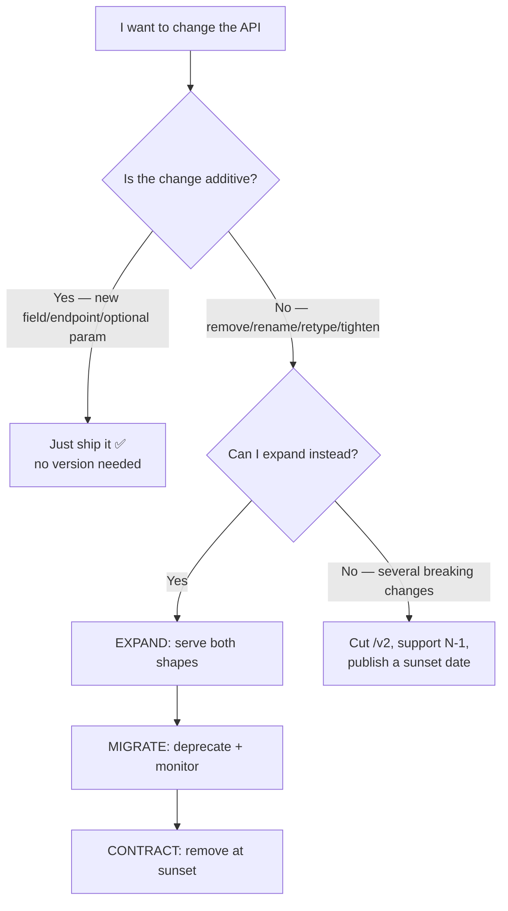

# APIs · REST · Design & Versioning — a slow, example-first walkthrough

> **Where this sits:** Technology `APIs & HTTP` → Main topic `REST` → Sub topic `Design & versioning`.
> Prerequisite: [`../../Http/Fundamentals/HttpFundamentals.md`](../../Http/Fundamentals/HttpFundamentals.md).
> Runnable code: [`ResourceUrl.cs`](ResourceUrl.cs) · [`ApiChange.cs`](ApiChange.cs) ·
> [`VersionedOrderApi.cs`](VersionedOrderApi.cs) · [`RestDesignDemo.cs`](RestDesignDemo.cs).

---

## 1. WHAT — REST is a style, not a protocol

From Roy Fielding's 2000 dissertation. The working essence:

> **Resources (nouns) identified by URLs, manipulated with standard HTTP methods, exchanging
> representations (usually JSON).**

The big shift from RPC thinking: **URLs name *things*, not *actions*.** The verb is already the HTTP
method — repeating it in the path is redundant.

| ❌ RPC-style | ✅ REST-style |
|---|---|
| `POST /getOrders` | `GET /orders` |
| `POST /createOrder` | `POST /orders` |
| `POST /updateCustomer` | `PUT /customers/10` |
| `POST /deleteOrder?id=5` | `DELETE /orders/5` |

> 🧠 **The URL names the thing; the method names the action.** A verb in your path usually means the
> method is wrong too.

### Resource modelling rules
```
/customers                     collection (plural)
/customers/10                  one item
/customers/10/orders           containment
/orders?status=open&page=1&pageSize=20     filtering / paging
```
- **Plural**, consistently.
- **Don't nest beyond ~2 levels** — once a child has its own id, address it directly (`/orders/5`).
- **Query strings for filtering, sorting, paging.**
- **Non-CRUD actions:** an action sub-resource is the pragmatic norm — `POST /orders/5/cancel`.
  (Purist alternative: `PATCH /orders/5` with `{"status":"cancelled"}`. The sub-resource is clearer
  when the action has real side effects like issuing refunds.)

> ☠️ **Why a filter must not be a path segment:** `/orders/open` doesn't **compose** (how do you add
> "for customer 10, last month"?), causes **endpoint explosion**, and — the killer — **collides with the
> id route**: given `/orders/5` means "order 5", your router cannot tell whether `/orders/open` is an
> **id** or a **status**.

### Richardson Maturity Model
| Level | What | Reality |
|---|---|---|
| 0 | one endpoint, everything POSTed to it | legacy RPC-over-HTTP |
| 1 | **Resources** — many URLs | partial |
| 2 | **+ HTTP verbs & status codes** | ⭐ **where good real APIs live** |
| 3 | **+ HATEOAS** (responses carry links) | rare; usually not worth it |

> 🧠 **Level 2 is the pragmatic target.** Almost nothing in production is Level 3 — that's a legitimate
> engineering choice, not laziness.

### Status codes that signal intent
| Operation | Return |
|---|---|
| `POST /orders` created | **201 Created** + `Location: /orders/5` + the created body |
| `GET` found | 200 OK |
| `PUT` updated, nothing to return | **204 No Content** |
| `DELETE` succeeded | **204 No Content** |
| Queued / long-running | **202 Accepted** |
| Duplicate or state conflict | **409 Conflict** |
| Validation failed | 400 (or 422) + Problem Details |

`201` needs all three parts: the code (machine-readable "created"), **`Location`** (where it lives now,
so the client needn't guess your URL scheme), and the body (server-generated id, timestamps, totals).
ASP.NET Core's `CreatedAtAction`/`CreatedAtRoute` exist to produce exactly this.

## 2. WHY versioning exists
Once someone consumes your API, its shape is a **contract**. A mobile app in users' hands may be six
months old; another team can't redeploy on your schedule.

### But most changes need no version
| Change | Breaking? |
|---|---|
| **Add** an optional response field | ✅ no |
| **Add** an endpoint | ✅ no |
| **Add** an optional query parameter | ✅ no |
| **Remove** or **rename** a field | ❌ **yes** |
| **Change a field's type** (`"5"` → `5`) | ❌ **yes** |
| Make an optional request field **required** | ❌ **yes** |
| Change status codes / semantics | ❌ **yes** |

> 🧠 **Additive changes are free — the best versioning strategy is not needing to version.**

This depends on the **tolerant reader** principle: clients must **ignore fields they don't recognise**.
Most do (`System.Text.Json` ignores unknown properties), but some don't (Newtonsoft with
`MissingMemberHandling.Error`, strict generated clients). So **write it into your API guidelines**:
*"clients must ignore unknown fields; we reserve the right to add them."* That single sentence buys you
years of additive evolution.

### Handling a genuinely breaking change — expand → migrate → contract
A **rename** is the sneaky one: it usually doesn't throw, it silently yields `null`.

1. **EXPAND** — return **both** names. Non-breaking.
   ```json
   { "name": "Alice", "phone": "0612345678", "phoneNumber": "0612345678" }
   ```
2. **MIGRATE** — document the old field as deprecated, publish a sunset date, **monitor who still reads it**.
3. **CONTRACT** — remove it once usage reaches zero (or at the announced date).

> 🧠 **Never big-bang a breaking change.** And *batch* breaking changes — a new version should carry
> several, not one renamed field.

## 3. HOW — the four versioning strategies
```http
1. URI path        GET /v1/orders                                    ← recommended default
2. Query string    GET /orders?api-version=2024-01-01                ← Azure's style
3. Custom header   GET /orders   api-version: 2
4. Media type      GET /orders   Accept: application/vnd.myapi.v2+json   ← "purest"
```

| | Pros | Cons |
|---|---|---|
| **URI path** | obvious, browsable, trivial to route/cache, impossible to forget | the same resource now has **two URLs** |
| **Query string** | one path; good for date-based versions | easy to omit; can be lost in caching |
| **Header** | clean URLs | invisible in a browser, painful to debug |
| **Media type** | most REST-correct | weak tooling, rarely used |

> 🧠 **Default to URI path versioning.** Discoverability and operational simplicity beat theoretical
> purity — and whatever you choose, **be consistent across every endpoint**.

### Lifecycle: getting rid of v1
- Support **N-1** (current + previous), not five.
- **Announce the sunset date when you ship v2**, not later.
- **Signal it in the responses** (RFC 8594) so clients' *own* logs warn them:
  ```http
  Deprecation: true
  Sunset: Sat, 31 Jan 2027 23:59:59 GMT
  Link: </v2/customers>; rel="successor-version"
  ```
  Seen via browser DevTools → Network → Response Headers, `curl -i`, Postman's Headers tab, or in code:
  ```csharp
  if (response.Headers.Contains("Deprecation"))
      logger.LogWarning("API deprecated. Sunset: {S}", response.Headers.GetValues("Sunset").First());
  ```
- **Track usage per version *per client*** so you can contact stragglers directly.
- **Turn it off on the announced date** — optionally after short "brownouts" to flush out silent consumers.
- **Version the contract, not your internal code** — one internal model, mapped to v1/v2 shapes at the edge.

> ⚠️ Waiting for usage to hit zero on its own can mean waiting forever. **Zero usage is the goal; a
> published date is the mechanism.**

## 4. The runnable model in this repo
```powershell
dotnet run --project src/BackendArchitect -c Release
```
```
URL review:
  BAD /api/getCustomerOrders          'getCustomerOrders' puts a verb in the path
  BAD /orders/open                    'open' is a filter — use a query string (collides with the id route)
  OK  /customers/10/orders            names resources; the method supplies the action
  OK  /orders?status=open&page=1&pageSize=20

Renaming 'phone' to 'phoneNumber' without breaking v1 clients:
  v1 client reads 'phone'          -> 0612345678
  v1 client against the v2 shape   -> NULL  <- silent breakage
  EXPAND phase: serve both names   -> phone=0612345678, phoneNumber=0612345678
```

That `NULL` is the lesson: a rename **fails silently**. No exception, no 500 — just empty phone numbers
appearing in someone's UI, discovered days later.



---

## Recap in one breath
REST = **resources named by URLs, actions supplied by HTTP methods** — no verbs in paths, plural
collections, shallow nesting, and **filters/paging in the query string** (a filter in the path collides
with the id route). Aim for **Richardson Level 2**. `POST` that creates returns **201 + Location + body**.
For evolution: **additive changes are free** (tolerant readers), while remove/rename/retype/tighten are
**breaking** — handle them with **expand → migrate → contract**, or a new version via **URI path**
versioning, supporting **N-1** with an announced **Sunset**.

## Warm-up questions
1. Redesign `POST /api/getCustomerOrders`, `POST /api/createOrder`, `POST /api/cancelOrder`.
2. Do you need a new version to add a field? What assumption does that rely on?
3. Why is renaming a field especially dangerous compared with removing one?
4. What three things does a successful `POST /orders` response contain?
5. Which versioning strategy would you pick, and what trade-off comes with it?
6. Why is "wait until v1 usage is zero" not a sufficient retirement plan?
7. What's wrong with `/orders/open` — give the routing reason.
