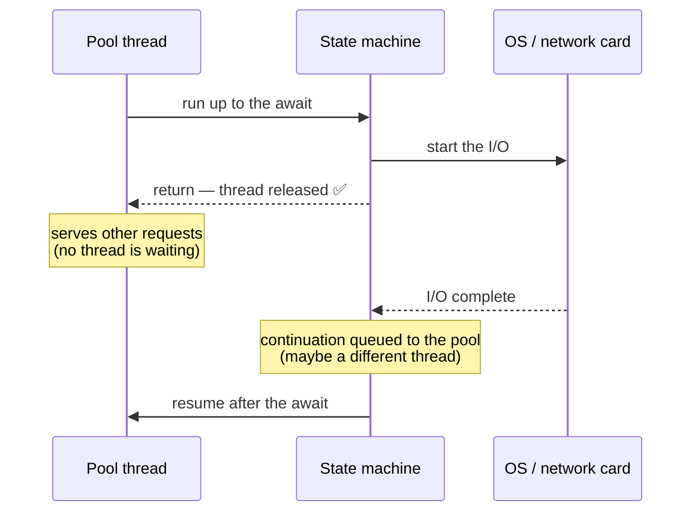

# Concurrency · async/await — a slow, example-first walkthrough

> **First topic of Month 3.** Everything else this month builds on it.
>
> **Where this sits:** Technology `Concurrency & Async` → Main topic `async/await` → Sub topic `Fundamentals`.
> Runnable code: [`FakeIoService.cs`](FakeIoService.cs) · [`AsyncPatterns.cs`](AsyncPatterns.cs) ·
> [`AsyncAwaitDemo.cs`](AsyncAwaitDemo.cs).

---

## The one sentence that fixes most confusion

> **`async`/`await` is not about doing things faster or in parallel. It's about not holding a thread
> hostage while you wait.**

## 1. WHY — the problem

```csharp
var response = httpClient.Get("...");   // 200ms
```
For those 200 ms the thread does **nothing** — no CPU work, just waiting. And a thread costs **~1 MB of
stack** plus scheduler overhead. 1,000 concurrent requests ≈ **1 GB of RAM spent on threads that are all
idle** — and it's the same failure shape as the slow dependency in
[§6.2](../../Reliability/Resilience/Resilience.md): threads held → pool exhausted → everything dies.

> 🧠 During I/O there is **no work to do** — the network card is doing it. Blocking a thread to wait is
> hiring someone to stare at the oven while the bread bakes.

## 2. WHAT happens at an `await`

```csharp
async Task<string> GetDataAsync()
{
    Console.WriteLine("before");                        // ① caller's thread, synchronously
    var result = await httpClient.GetStringAsync(url);  // ②
    Console.WriteLine("after");                         // ③
    return result;
}
```

**①** Runs synchronously on the calling thread.
**②** The compiler has rewritten this into a **state machine**. It starts the I/O, checks whether it's
*already* finished (if so, carries straight on — no cost), and otherwise **registers the rest of the
method as a continuation and returns** — releasing the thread back to the pool.
**③** When the OS signals completion, the continuation is scheduled onto **a pool thread — possibly a
different one**.

> 🧠 **"There is no thread."** While awaiting I/O, no thread anywhere is dedicated to your operation.

### What the compiler generates (roughly)
```csharp
class GetDataAsyncStateMachine
{
    int _state = -1;
    TaskAwaiter<string> _awaiter;

    void MoveNext()
    {
        switch (_state)
        {
            case -1:
                Console.WriteLine("before");
                _awaiter = httpClient.GetStringAsync(url).GetAwaiter();
                if (!_awaiter.IsCompleted)
                {
                    _state = 0;
                    _awaiter.OnCompleted(MoveNext);   // resume here later
                    return;                           // ← THE THREAD IS RELEASED
                }
                goto case 0;
            case 0:
                var result = _awaiter.GetResult();
                Console.WriteLine("after");
                break;
        }
    }
}
```
That `return` is the whole trick: the method **exits**, and `MoveNext` is called again later.

⚠️ Because the continuation can resume on a different thread, anything **thread-affine**
(`[ThreadStatic]`, `ThreadLocal`, thread-name-based logging, old UI controls) is unsafe across an await.

## 3. Three words people mix up
| Term | Meaning | Tool |
|---|---|---|
| **Concurrency** | *dealing with* many things at once (structure) | `async`/`await` |
| **Parallelism** | *doing* many things at once (needs cores) | `Parallel.For`, PLINQ |
| **Asynchrony** | not blocking while waiting | `async`/`await` |

> 🧠 **I/O-bound → `async`/`await`. CPU-bound → parallelism.** The wrong one adds cost and delivers nothing.

## 4. Sequential vs concurrent awaits
```csharp
// ❌ 300ms — each await waits before the next starts
var user   = await GetUserAsync();
var orders = await GetOrdersAsync();
var prices = await GetPricesAsync();

// ✅ 100ms — start all three, then wait
var userTask = GetUserAsync(); var ordersTask = GetOrdersAsync(); var pricesTask = GetPricesAsync();
await Task.WhenAll(userTask, ordersTask, pricesTask);
```
> 🧠 **Calling an async method starts it; `await` is where you stop and wait.** Sequential code awaits too early.

⚠️ If several tasks fail, `await Task.WhenAll(...)` rethrows only the **first**. Inspect
`whenAllTask.Exception` (an `AggregateException`) to see them all.

## 5. The four classic bugs

### `.Result` / `.Wait()`
- **Always** blocks a thread — you paid async's complexity and threw away the benefit. This is how
  **thread-pool starvation** starts (the pool only grows ~1 thread/second).
- **May deadlock** where a `SynchronizationContext` exists (WinForms, WPF, classic ASP.NET): the blocked
  thread holds the context that the continuation needs to resume on.
  *(ASP.NET Core has no `SynchronizationContext`, so this specific deadlock generally won't occur — the
  blocking still will.)*
- Also wraps exceptions in `AggregateException`.
- **Fix: async all the way up.** `async Task Main` exists; controllers and background services are all
  async-capable. Forced by a legacy interface? `GetAwaiter().GetResult()` avoids the exception wrapping —
  a wart, not a solution.

### `async void`
```csharp
try { SaveData(); }            // async void
catch (Exception ex) { /* ❌ NEVER REACHED */ }
```
- **Can't be awaited** — fire-and-forget, no completion signal.
- **Exceptions crash the process** — no task holds them, so they surface as unhandled on the pool.
- **Untestable** — no task to await.
- **Only legitimate use: event handlers**, and then wrap the whole body in your own `try/catch`.

### `Task.Run` around synchronous I/O ("async over sync")
```csharp
var users = await Task.Run(() => _database.GetUsers());   // ❌
```
It doesn't remove the blocking, it **relocates** it: the caller's thread is freed but a **pool thread now
blocks instead**, plus queueing overhead. Same waste, better disguised.
**Fix:** use a genuinely async API (`GetUsersAsync`). If the library has none, you are blocking — say so
rather than hiding it.
*Exception:* in a **desktop UI** app this is legitimate — it protects the one thread that matters.

### Async for CPU-bound work
There's no waiting to eliminate, so async adds state-machine overhead for nothing. Use parallelism:
```csharp
Parallel.ForEach(passwords, new ParallelOptions { MaxDegreeOfParallelism = 4 }, Hash);
```
⚠️ On a server, unbounded `Parallel.ForEach` makes *one* request fast by starving the others — cap it.

## 6. The runnable model in this repo
```powershell
dotnet run --project src/BackendArchitect -c Release
```
```
5 independent 50ms calls:
  awaited one by one :  275 ms   <- the durations add up
  started then WhenAll:   66 ms   <- all in flight at once

20 concurrent calls — how many pool threads did each style consume?
  Task.Run + Thread.Sleep :  8 threads,  181 ms  <- async over sync
  real async I/O          :  1 threads,   65 ms  <- no thread waits
```

**1 thread serving 20 concurrent calls.** That single number is the entire point of async — and the
8-vs-1 comparison is why "async over sync" is worth refusing in code review.



---

## Recap in one breath
`async`/`await` **frees the thread while you wait** — it does not add speed or parallelism. At an
`await` the compiler's **state machine** registers a continuation and **returns**, so *no thread* is
dedicated to in-flight I/O; the code afterwards may resume on a **different** thread. Start independent
calls **before** awaiting them (`Task.WhenAll`). Avoid **`.Result`/`.Wait()`** (blocks, may deadlock),
**`async void`** (uncatchable, untestable), and **`Task.Run` around sync I/O** (relocates the block).
**I/O → async. CPU → parallelism.**

## Warm-up questions
1. During a 200 ms `await`, what is the calling thread doing?
2. Three independent 100 ms calls awaited one at a time — how long, and how do you fix it?
3. Name the two problems with `.Result`.
4. Why can't a `try/catch` around an `async void` call catch its exception?
5. What does `Task.Run` around a synchronous database call actually achieve?
6. You must hash 10,000 passwords. Async or parallel — and why?
