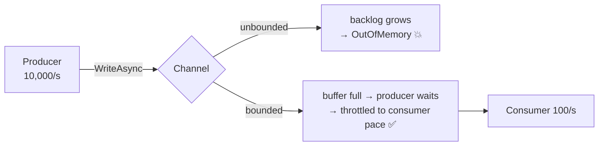

# Concurrency · Task, ValueTask, IAsyncEnumerable & Channel — a slow, example-first walkthrough

> **Where this sits:** Technology `Concurrency & Async` → Main topic `Streams & queues`.
> Prerequisite: [`../AsyncAwait/AsyncAwait.md`](../AsyncAwait/AsyncAwait.md).
> Runnable code: [`StreamingVsBuffering.cs`](StreamingVsBuffering.cs) ·
> [`CachedCustomerLookup.cs`](CachedCustomerLookup.cs) · [`WorkQueue.cs`](WorkQueue.cs) ·
> [`StreamsDemo.cs`](StreamsDemo.cs).

---

## The framing that makes this click

All four answer one question differently: **how many values, and when do they arrive?**

| | **One value** | **Many values over time** |
|---|---|---|
| **Consumer pulls** | `Task<T>` | `IAsyncEnumerable<T>` |
| **Often already available** | `ValueTask<T>` | — |
| **Producer pushes, decoupled** | — | `Channel<T>` |

> 🧠 Choose by **shape**, not fashion.

## 1. `Task<T>` — one value, later
One operation, one result, awaited once. Worth knowing: a `Task` is a **heap allocation** — irrelevant
for a database call, relevant on a path called millions of times a second.

## 2. `ValueTask<T>` — one value, *usually already there*
For methods whose answer is **often synchronous**, typically a cache hit:

```csharp
public ValueTask<Customer> GetCustomerAsync(int id)
{
    if (_cache.TryGetValue(id, out var cached))
        return new ValueTask<Customer>(cached);                 // ZERO allocation
    return new ValueTask<Customer>(FetchFromDbAsync(id));       // wraps a real Task
}
```

⚠️ **The rules** — a `ValueTask` may be backed by a **pooled object that gets recycled**:

| Rule | Why |
|---|---|
| **Await exactly once** | awaiting twice can return **someone else's result** |
| No `.Result` / `.Wait()` | may not be complete, and unsafe to block on |
| No `Task.WhenAll` | needs a real Task — call `.AsTask()` |
| Don't store it | the backing object may already be reused |

> 🧠 **Default to `Task`. Use `ValueTask` only on a hot path where you've *measured* the allocations.**
> It's a sharp-edged optimisation, not a better `Task`.

## 3. `IAsyncEnumerable<T>` — many values, pulled, over time

```csharp
// ❌ buffers ALL 1,000,000 rows before the caller sees anything
async Task<List<Order>> GetOrdersAsync() { ... }

// ✅ yields each row as it arrives
async IAsyncEnumerable<Order> GetOrdersAsync([EnumeratorCancellation] CancellationToken ct = default)
{
    await foreach (var row in _reader.ReadRowsAsync(ct))
        yield return Map(row);
}

await foreach (var order in GetOrdersAsync())
    Process(order);        // works on row 1 while row 2 is still arriving
```

> ⚠️ **The axis is BATCH vs STREAM, not async vs sync.** `Task<List<T>>` is *also* async and *also*
> non-blocking — it just materialises everything first. Plenty of slow endpoints are perfectly
> non-blocking and still hopeless on memory.

Also: it's **lazy** — nothing runs until you enumerate, and abandoning the loop early stops the work.

## 4. `Channel<T>` — many values, *pushed*, producer decoupled from consumers

```csharp
var channel = Channel.CreateBounded<Order>(capacity: 100);

await channel.Writer.WriteAsync(order);     // waits (asynchronously) when full
channel.Writer.Complete();                  // tell consumers no more are coming

await foreach (var order in channel.Reader.ReadAllAsync())   // any number of consumers
    Process(order);
```

### Why not `IAsyncEnumerable` for a multi-consumer queue?
**Topology, not speed.** An enumerator holds a position and **isn't thread-safe**, so several consumers
can't share one — you'd get duplicated work or undefined behaviour. A channel hands each item to
**exactly one** consumer, safely. It also **decouples lifetimes** (the producer doesn't know how many
consumers exist) and provides **backpressure**.

### Bounded vs unbounded — the important decision
```csharp
Channel.CreateUnbounded<Order>();             // ⚠️ the limit is your RAM
Channel.CreateBounded<Order>(capacity: 100);  // ✅ backpressure
```

With a fast producer (10,000/s) and slow consumer (100/s), an unbounded channel accumulates **9,900
items per second** → ~594,000 after a minute → GC pressure → **`OutOfMemoryException`**, and every
queued item is lost with the process.

**A `Channel` is not a message broker.** The comparison is instructive:

| | **Event Hub / Service Bus** | **`Channel<T>`** |
|---|---|---|
| Lives | **on disk**, in a broker | **in your process's RAM** |
| Survives a restart | ✅ | ❌ everything lost |
| Limit | retention policy | **your memory** |
| When full | rejects / ages out; broker stays healthy | **your process dies** |

**Backpressure** is the fix: `WriteAsync` waits when the buffer is full, so the producer runs at the
consumers' pace — and because a throttled producer stops pulling from *its* source, the pressure
**propagates upstream** to whoever can actually slow down.

`BoundedChannelFullMode` chooses what "full" means: `Wait` (default), `DropOldest`, `DropNewest`,
`DropWrite`. Dropping is often right for telemetry; waiting is right for orders.

> 🧠 **`CreateUnbounded` doesn't mean "no limit" — it means "the limit is your RAM, discovered in
> production."** Bounded channels convert a memory leak into a survivable slowdown.

## 5. The runnable model in this repo
```powershell
dotnet run --project src/BackendArchitect -c Release
```
```
40 rows at 5ms each — when can you act on row 1?
  Task<List<Order>>      :  676 ms, peak 40 rows in memory
  IAsyncEnumerable<Order>:   10 ms, peak  1 row  in memory

ValueTask on a 95%-cache-hit path (100 calls):
  completed synchronously (no allocation):  95
  went to the database (real async)      :   5

Fast producer, slow consumer (60 items):
  unbounded channel: peak backlog 60 items, producer waited    2 ms
  bounded(5)        : peak backlog  6 items, producer waited  779 ms  <- backpressure

One channel, 3 consumers (what IAsyncEnumerable cannot do):
  items handled per consumer: #0=2, #1=14, #2=14
  total = 30 of 30, each item handled exactly once
```

Three numbers to sit with:
- **676 ms → 10 ms** time-to-first-row, and **40 rows → 1** in memory. Same data, same async-ness.
- **95 of 100** calls never allocated a Task.
- **backlog 60 → 6**, bought with **779 ms of producer waiting**. That trade — *time for memory* — is
  what backpressure *is*.



---

## Recap in one breath
Pick by **shape**: `Task<T>` = one value later; `ValueTask<T>` = one value *usually already there*
(await once, no `.Result`, no `WhenAll` — measure first); `IAsyncEnumerable<T>` = many values **pulled**
as a stream (flat memory, instant first item — batch vs stream, *not* async vs sync); `Channel<T>` =
many values **pushed** between independent producers and consumers, the only option for
**multi-consumer** fan-out. Always prefer **bounded** channels: `WriteAsync` waiting is **backpressure**,
and it converts an unbounded memory leak into a visible slowdown that propagates upstream.

## Warm-up questions
1. Why is `IAsyncEnumerable` better than `Task<List<T>>` for a million rows — and what is the axis *not*?
2. Fast producer, slow consumer, unbounded channel — what happens, and how does it differ from Event Hub?
3. When would you switch a return type to `ValueTask<T>`, and what are the rules?
4. One producer, three consumers — `IAsyncEnumerable` or `Channel`? Give the structural reason.
5. A bounded channel fills up. What happens to the producer, and what's it called?
