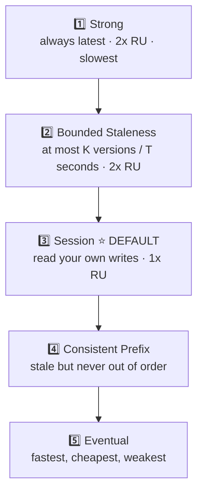
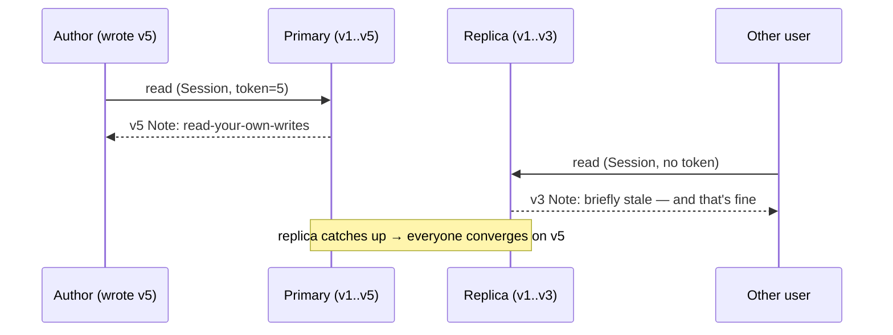

# Databases · Cosmos DB · Consistency Levels — a slow, example-first walkthrough

> **The last topic of Month 1.** It closes the loop on the "eventual consistency" cost first named in
> [`../../NoSQL/Concepts/NoSqlConcepts.md`](../../NoSQL/Concepts/NoSqlConcepts.md).
>
> **Where this sits:** Technology `Databases` → Main topic `Cosmos DB` → Sub topic `Consistency levels`.
> Runnable code: [`ReplicatedStore.cs`](ReplicatedStore.cs) · [`ConsistencyLevelsDemo.cs`](ConsistencyLevelsDemo.cs).

---

## The idea — you've met this dial before

| Dial | Protects against | Trade |
|---|---|---|
| **SQL isolation levels** ([notes](../../SQL/IsolationLevels/IsolationLevels.md)) | concurrent transactions inside one database | correctness ↔ concurrency |
| **Cosmos consistency levels** | **replicas** being out of sync across machines/regions | freshness ↔ latency, availability, cost |

> 🧠 Isolation asks *"how much of another **transaction's** unfinished work can I see?"*
> Consistency asks *"how much of another **replica's** unfinished catch-up can I see?"*
> Same dial, different axis.

## The five levels (strongest → weakest)

### 1️⃣ Strong
Every read returns the **most recent committed write**. No staleness, ever.
❌ Highest latency, **reads cost 2× RU**, and it constrains your global-distribution options.

### 2️⃣ Bounded Staleness
Reads may lag, but by **at most K versions or T seconds** — *you* set the bound.
✅ A guaranteed ceiling on staleness. ❌ Still 2× RU on reads.

### 3️⃣ Session ⭐ **the default — and usually the right answer**
Within a session you always **read your own writes**; others may briefly see older data.
✅ Kills the classic bug: *user posts a comment → page reloads → their own comment is missing.*
✅ Normal RU cost, low latency.
⚙️ Implemented with a **session token** the SDK carries per request. **Consequence:** if a user's
requests are load-balanced across **different app instances**, you must **flow that token** between
them, or the guarantee silently breaks.

### 4️⃣ Consistent Prefix
May be stale, but **never out of order**. Writes A→B→C can be seen as A, or A,B — **never A,C**.

### 5️⃣ Eventual
No ordering guarantee; converges eventually.
✅ Lowest latency, cheapest, most available. ❌ Stale *and* possibly out of order.
Use for like counts, view counters — anything harmless when briefly wrong.



## Where you set it
The **account** carries a default; an individual request may be **weakened** (never strengthened):
```csharp
await container.ReadItemAsync<Order>(id, new PartitionKey(pk),
    new ItemRequestOptions { ConsistencyLevel = ConsistencyLevel.Eventual });  // cheaper for this read
```

> 🧠 **Choose Session unless you have a specific reason not to.** Strong is rarely necessary and costs
> you latency, money, and global flexibility.

## The runnable model in this repo

[`ReplicatedStore.cs`](ReplicatedStore.cs) models one primary plus a **lagging replica** — the gap
between them *is* the staleness — and serves the same read under each level.

```powershell
dotnet run --project src/BackendArchitect -c Release
```
```
Primary has v1..v5; replica has caught up to v3 (lag 2)
  level                 author reads  other user reads  read cost
  Strong                          v5                v5       2.0x
  BoundedStaleness                v4                v4       2.0x
  Session                         v5                v3       1.0x
  ConsistentPrefix                v3                v3       1.0x
  Eventual                        v3                v3       1.0x
```

**The Session row is the whole lesson:** the **author sees v5** (their own write) while **another user
still sees v3** — at **1× cost**. That's why it's the default: it fixes "I posted it but can't see it"
without paying Strong's latency and doubled read charge.



## Choosing
| Need | Level |
|---|---|
| Must never read stale (e.g. a strict balance check) | **Strong** |
| "Never more than N seconds behind" | **Bounded Staleness** |
| Normal app: users must see their own actions | **Session** ⭐ |
| Order matters, lag doesn't | **Consistent Prefix** |
| Counters, likes, telemetry | **Eventual** |

---

## Recap in one breath
Consistency levels are the **dial for how stale a read may be** across replicas — the distributed
sibling of SQL's isolation levels. Five levels: **Strong** (always latest, 2× RU, slow) → **Bounded
Staleness** (a guaranteed ceiling, 2× RU) → **Session** ⭐ (read your own writes, default, 1× RU) →
**Consistent Prefix** (stale but never out of order) → **Eventual** (fastest, weakest). Set a default on
the account and **weaken per request** where it's safe. **Default to Session.**

> 🧠 **Stronger = fresher but slower, costlier, less available. Weaker = faster and cheaper but staler.**

## Warm-up questions
1. How is a consistency level like a SQL isolation level — and how is it different?
2. Why is Session the default rather than Strong?
3. What breaks about Session consistency behind a load balancer, and what must you do about it?
4. Which two levels charge double for reads?
5. Give a real feature where **Eventual** is clearly good enough.
