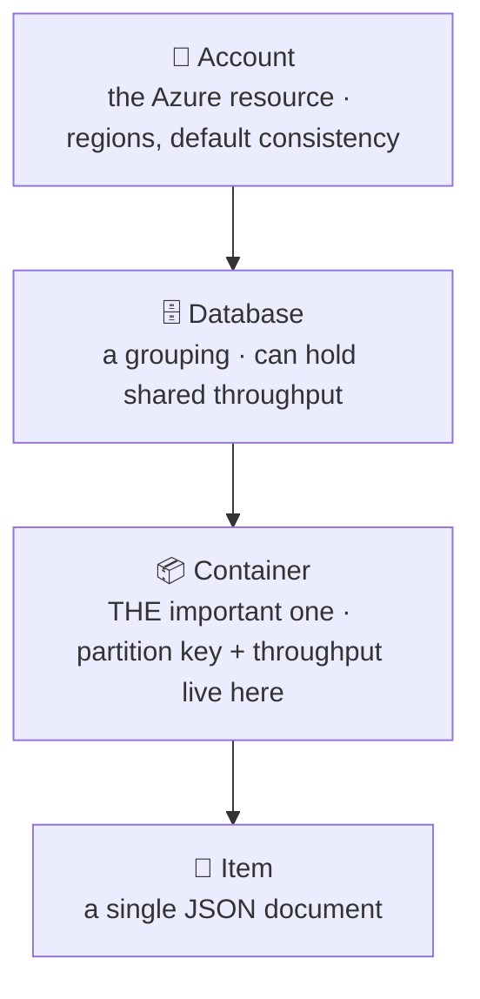

# Databases · Cosmos DB · Fundamentals — a slow, example-first walkthrough

> **How to read this:** same order — **Who → What → …**. This sub topic covers **what Cosmos is and how
> it's structured**. The decisions that make it fast or expensive live in the sibling sub topics:
> **Partition keys**, **Request Units (RU/s)**, **Indexing policy**, **Consistency levels** — coming next.
>
> **Where this sits:** Technology `Databases` → Main topic `Cosmos DB` → Sub topic `Fundamentals`.
> Builds on [`../../NoSQL/Concepts/NoSqlConcepts.md`](../../NoSQL/Concepts/NoSqlConcepts.md).

---

## 1. WHO — who cares about Cosmos DB?

- **Who needs it:** any .NET/Azure engineer whose data lives in Cosmos. Critically, **Cosmos punishes
  ignorance with a bill** — unlike SQL Server, where a bad design merely runs slowly, here it runs slowly
  *and* charges for every wasted operation. It's a **cost** skill as much as a performance skill.
- **Who runs it:** Microsoft. It's **PaaS** — fully managed. You never patch a server, size a disk, or
  configure replication. You configure **throughput** and **partitioning**; Azure does the rest.

> 🧠 The shift from SQL Server: you're no longer tuning a *machine*, you're tuning a **budget** and a
> **data layout**.

## 2. WHAT — what is Cosmos DB?

**One sentence:** Azure's **globally distributed, horizontally scaling, multi-model NoSQL database**,
sold by **throughput** rather than by server.

Three defining traits:
1. **Globally distributed** — tick a box and data replicates to another region.
2. **Horizontally scaling** — spreads across many machines automatically (this is what dropping joins bought).
3. **Guaranteed by SLA** — single-digit-ms reads, 99.999% availability, contractually promised.

### It speaks several of the NoSQL families
| Cosmos API | Family | Use |
|---|---|---|
| **NoSQL (Core)** ⭐ | 📄 Document | **The default** — use for all new work |
| MongoDB | 📄 Document | Lift-and-shift an existing Mongo app |
| Cassandra | 📊 Wide-column | Lift-and-shift Cassandra |
| Gremlin | 🕸️ Graph | Relationship queries |
| Table | 🔑 Key-value | Legacy Azure Table Storage |

**Why Core for new projects** (in order): it's the **native engine** (others are compatibility layers
translating a foreign protocol) · **new features land here first**, sometimes only here · **best .NET SDK
and tooling** · **full feature set** (change feed, transactional batch, complete consistency model).
The others exist to **migrate an existing app without rewriting its data layer** — a migration benefit,
not a greenfield one.

> 🧠 **New project → Core API. Migrating Mongo/Cassandra/Gremlin → the matching API.** Never pick a
> compatibility API for greenfield work.

And the "Not Only SQL" myth proves itself — the NoSQL API queries JSON *with SQL syntax*:
```sql
SELECT * FROM c WHERE c.customerId = "10"
```

### The hierarchy (four words)



**Why the container is the level that matters** — every decision affecting speed and cost is made there:

| Set on the container | Why it matters |
|---|---|
| **Partition key** | how data spreads across machines — the #1 performance decision |
| **Throughput (RU/s)** | your speed limit *and* your bill |
| **Indexing policy** | what's indexed (affects write cost) |
| **TTL** | auto-delete old items |
| **Unique keys** | extra uniqueness constraints |

> ⚠️ **The partition key is immutable.** You cannot change it on an existing container — fixing a bad
> one means **creating a new container and migrating every item**. In production that's a project, not
> an afternoon. Contrast SQL Server, where a bad index is a one-line fix at 2am. *That asymmetry is why
> partition-key design deserves real study.*

> 🧠 Account and database are mostly **packaging**. The **container is where the decisions live** —
> almost every Cosmos question ("why slow? why expensive? why did this fail?") resolves to a container-level choice.

### An item is just JSON (plus system fields)
```json
{
  "id": "order-1",           // required; unique WITHIN its logical partition
  "customerId": "10",        // ← the partition key (a field you choose)
  "product": "Latte",
  "price": 3.50,
  "_ts": 1721692800,         // system: last-modified timestamp
  "_etag": "\"3b00...\""     // system: version, for optimistic concurrency
}
```

**`id` is unique only within a logical partition — not globally.** The real primary key is the pair
**partition key + id**:

| customerId (PK) | id | Allowed? |
|---|---|---|
| `"10"` | `"order-1"` | ✅ |
| `"11"` | `"order-1"` | ✅ **yes** — different logical partition |
| `"10"` | `"order-1"` again | ❌ duplicate within the same partition |

Two consequences:
```csharp
// ✅ cheapest operation in Cosmos (~1 RU) — you supplied the full address
await container.ReadItemAsync<Order>("order-1", new PartitionKey("10"));

// ❌ cross-partition query — Cosmos fans out to every partition
await container.GetItemQueryIterator<Order>("SELECT * FROM c WHERE c.id = 'order-1'");
```
…and **don't assume `id` alone identifies a document** in app code.

> 🧠 **Partition key + id = the address.** Give Cosmos the full address and it's instant; give half and
> it searches the whole city.

**`_etag`** is how you do **optimistic concurrency** — "only update if nobody changed it since I read it."

### No fixed schema, no cross-container joins
- **Every item in a container may have a different shape** — Cosmos won't stop you (schema-on-read; *your*
  code enforces it).
- **No joins between containers.** Cosmos SQL *has* a `JOIN` keyword, but it only joins **within a single
  document** (into its own nested arrays). The no-joins bargain, made concrete.

---

## Recap so far
Cosmos DB is Azure's **managed, globally distributed, horizontally scaling document database**, billed by
**throughput**. Use the **Core (NoSQL) API** for new work. Structure is
**Account → Database → Container → Item**, and the **container is where every decision lives** —
including the **immutable partition key**. An item is JSON whose true key is **partition key + id**.

## What's next (sibling sub topics)
- **Partition keys** — how data spreads; hot partitions; choosing well ⏳
- **Request Units (RU/s)** — the currency of Cosmos; why a query costs what it costs ⏳
- **Indexing policy** — indexed by default, and why you might trim it ⏳
- **Consistency levels** — the five levels, and the tunable version of eventual consistency ⏳

## Warm-up questions for next session
1. Why is the **container** the most important level of the hierarchy?
2. Can two items in one container share `id: "order-1"`? Under what condition?
3. Which API should a new project use, and why do the others exist?
4. Why is `ReadItemAsync(id, partitionKey)` so much cheaper than querying by `id` alone?
