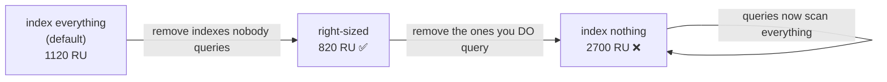

# Databases · Cosmos DB · Indexing Policy — a slow, example-first walkthrough

> Follows directly from [`../RequestUnits/RequestUnits.md`](../RequestUnits/RequestUnits.md): trimming
> indexes is what made those writes affordable. Here's what you're actually trimming.
>
> **Where this sits:** Technology `Databases` → Main topic `Cosmos DB` → Sub topic `Indexing policy`.
> Runnable code: [`IndexPolicy.cs`](IndexPolicy.cs) · [`IndexingPolicyDemo.cs`](IndexingPolicyDemo.cs).

---

## 1. WHAT — and the inverted default

**One sentence:** the indexing policy is a JSON document on the container declaring **which property
paths get indexed**.

The thing to internalize — it's the **opposite** of SQL Server:

| | SQL Server | Cosmos DB |
|---|---|---|
| **Default** | index **nothing** — you opt *in* | index **everything** — you opt *out* |
| **Your job** | "what should I add?" | "**what can I remove?**" |

> 🧠 In SQL you *add* indexes to make reads fast. In Cosmos they're already all there — you *remove*
> them to make **writes cheap**. Same trade, opposite starting point.

The default policy on every new container:
```json
{
  "indexingMode": "consistent",
  "automatic": true,
  "includedPaths": [ { "path": "/*" } ],          // ← everything, recursively
  "excludedPaths": [ { "path": "/\"_etag\"/?" } ]
}
```
That `/*` is why a write costs ~9 RU instead of ~5.

## 2. WHY — the cost, and the trap

Every indexed property is **maintained on every write**. Index 20 properties → 20 index updates per
write, forever — including properties **nobody ever filters on** (a `description` blob, `notes`, a
nested payload).

**But the trap:** an unindexed property doesn't *fail* — it becomes **slow and expensive**. A query
filtering on an excluded path falls back to a **full scan of the partition**. You saved 3 RU per write
and now pay 20 RU per query.

> 🧠 **Over-indexing punishes writes. Under-indexing punishes reads.** The goal isn't "fewer indexes" —
> it's **right-sized**: index exactly what you filter, sort, or join on, and nothing else.

## 3. HOW — the moving parts

### Indexing mode
- **`consistent`** (default) — index updated synchronously with the write. Use this.
- **`none`** — no index. Only for a pure key-value container, or **temporarily during a bulk import**
  (turn off → load → turn back on).

### Included / excluded paths (mind the wildcards)
- `/path/*` → this path **and everything beneath it**
- `/path/?` → **just this scalar** value

```csharp
var properties = new ContainerProperties("Orders", "/customerId")
{
    IndexingPolicy = new IndexingPolicy
    {
        IndexingMode = IndexingMode.Consistent,
        Automatic = true,
        IncludedPaths = { new IncludedPath { Path = "/customerId/?" },
                          new IncludedPath { Path = "/product/?" },
                          new IncludedPath { Path = "/orderDate/?" } },
        ExcludedPaths = { new ExcludedPath { Path = "/*" } },   // exclude everything else
    },
};
await database.CreateContainerIfNotExistsAsync(properties);
```
> Exclude `/*`, then include the few paths you need — the "opt-in" shape most production containers
> converge on.

### Composite indexes — for multi-property `ORDER BY`
```csharp
IndexingPolicy.CompositeIndexes.Add(new Collection<CompositePath>
{
    new() { Path = "/customerId", Order = CompositePathSortOrder.Ascending },
    new() { Path = "/orderDate",  Order = CompositePathSortOrder.Descending },
});
// enables: SELECT * FROM c WHERE c.customerId = "10" ORDER BY c.orderDate DESC
```
Single-property `ORDER BY` works with the default range index, but **sorting by two or more properties
fails without a composite index** — a surprising error the first time you meet it.

### ✅ The relief: this one is mutable
Unlike the **partition key**, the indexing policy **can be changed on a live container**. Cosmos
re-indexes in the background using spare throughput. Getting it wrong is **recoverable**.

## 4. The runnable model in this repo

[`IndexingPolicyDemo.cs`](IndexingPolicyDemo.cs) prices the *same* workload under three policies:

```powershell
dotnet run --project src/BackendArchitect -c Release
```
```
Workload: 100 writes + 100 queries filtering on /product
          (1000 docs in the partition, 10 match)

  policy                     indexed    write    query   TOTAL RU
  index everything (default)       8      9.0      2.2       1120
  index nothing                    0      5.0     22.0       2700
  right-sized                      2      6.0      2.2        820  <- cheapest
```

Read the middle row carefully — **"index nothing" is the *worst* option**, more than twice the cost of
the default. Cheap writes bought at the price of scanning 1,000 documents on every query. This is why
"just trim your indexes" is incomplete advice.



> 🧠 It's a **U-shape**, not a slope. Both extremes lose.

## 5. How to right-size in practice
1. **List the properties your queries actually filter or sort on** — that's your include list.
2. **Exclude `/*`**, then include those.
3. **Add composite indexes** for any multi-property `ORDER BY`.
4. **Measure with `RequestCharge`** before and after — writes should drop, queries must not spike.
5. **Re-check when queries change.** A new query on an excluded path silently becomes a scan.

> ⚠️ The failure mode to watch for: someone adds a feature that filters on `/notes`, which you excluded
> months ago. Nothing errors — the query just quietly costs 10× more. **`RequestCharge` monitoring is
> what catches this.**

---

## Recap in one breath
Cosmos indexes **every property by default** (`/*`) — the inverse of SQL — so your job is deciding what
to **remove**. Every index is maintained on **every write**, but an unindexed filter falls back to a
**full partition scan**, so **over-indexing punishes writes and under-indexing punishes reads**.
Right-size: exclude `/*`, include exactly what you filter/sort on, add **composite indexes** for
multi-property `ORDER BY`, and verify with **`RequestCharge`**. Unlike the partition key, this policy is
**mutable** — mistakes are recoverable.

## Warm-up questions
1. What's the default indexing policy, and how does it differ from SQL Server's default?
2. Why is "index nothing" *more* expensive than "index everything" in the demo?
3. When would you set `indexingMode: none`?
4. What breaks if you `ORDER BY` two properties with no composite index?
5. Which is riskier to get wrong — the partition key or the indexing policy? Why?
