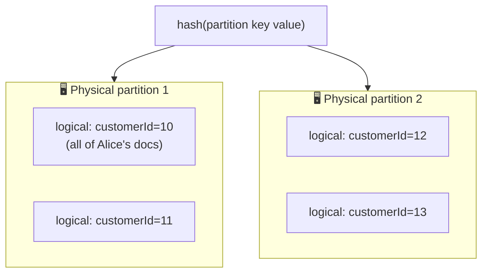
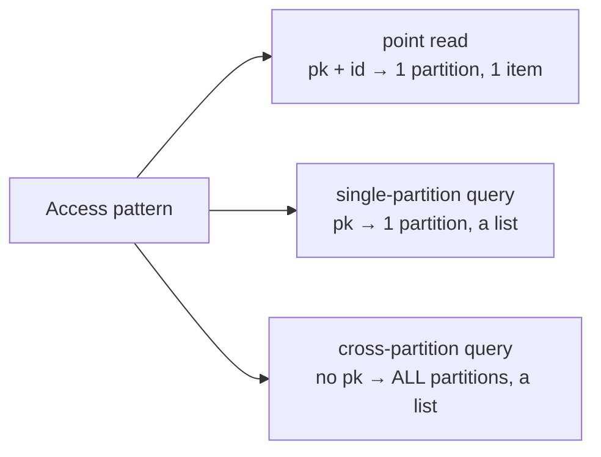

# Databases · Cosmos DB · Partition Keys (and `id`) — a slow, example-first walkthrough

> **The single highest-leverage thing to understand about Cosmos.** It decides whether your database is
> fast and cheap or slow and expensive — and it **cannot be changed** after the container is created.
>
> **Where this sits:** Technology `Databases` → Main topic `Cosmos DB` → Sub topic `Partition keys`.
> Prerequisite: [`../Fundamentals/Fundamentals.md`](../Fundamentals/Fundamentals.md).
> Runnable code: [`PartitionedContainer.cs`](PartitionedContainer.cs) · [`PartitionKeysDemo.cs`](PartitionKeysDemo.cs).

---

## 1. What `id` really is

**`id` is the name of one document inside its logical partition.**

| Fact | Why it matters |
|---|---|
| **Always a `string`** | Even if your key is the number `1001`, it's stored as `"1001"` |
| **You generate it — not Cosmos** | Don't rely on auto-generation; you need to *know* the id to read cheaply |
| **Unique only within a logical partition** | The same `id` in two different partitions is perfectly legal |
| **Max 255 chars** | — |
| **Cannot contain `/ \ # ?`** or a trailing space | An email is fine; a URL path is not — this bites when using natural keys |

```csharp
Id = Guid.NewGuid().ToString();   // safe default — no collisions, no meaning
Id = orderNumber;                  // natural key — meaningful, must be unique + legal chars
Id = $"{year}-{invoiceSeq}";       // composite — readable and sortable
```

> 🧠 Prefer a **natural key** when you have a stable, legal one — then you can point-read without a
> lookup first. Otherwise use a **GUID**.

## 2. What a partition key really is

**A field you nominate whose *value* decides which machine a document lives on.** Two levels:

- **Logical partition** — all documents sharing one partition-key **value** (e.g. all of customer 10's
  docs). You never create these; they appear as you write. A container can have millions.
- **Physical partition** — an actual machine. Cosmos **hashes** the partition-key value to pick one.
  Many logical partitions share a physical one, and Cosmos **splits** them automatically as data grows.



### The two limits that drive every decision
| Limit | Value | Consequence |
|---|---|---|
| **Logical partition max size** | **20 GB** | If one key value could ever exceed it, the design is broken — writes start failing |
| **Physical partition throughput** | ~10,000 RU/s | Traffic hammering one value gets throttled — a **hot partition** |

> 🧠 A partition key must **(a) spread data evenly** and **(b) never let one value grow past 20 GB.**
> Everything else is a footnote to those two rules.
> *(Verify current limits in the Azure docs — service quotas change over time.)*

## 3. How you do it in code

### Step 1 — Declare the path when creating the container (immutable!)
```csharp
using Microsoft.Azure.Cosmos;

var client = new CosmosClient(connectionString);
var database = await client.CreateDatabaseIfNotExistsAsync("ShopDb");

var container = await database.CreateContainerIfNotExistsAsync(
    id: "Orders",
    partitionKeyPath: "/customerId",   // note the leading slash
    throughput: 400);
```

### Step 2 — Your model carries both fields
The partition key isn't something you attach — **it's just a property in the JSON**:
```csharp
public class Order
{
    [JsonPropertyName("id")]           // must serialize to lowercase "id"
    public string Id { get; set; } = default!;

    [JsonPropertyName("customerId")]   // must match the path "/customerId" EXACTLY
    public string CustomerId { get; set; } = default!;

    public string Product { get; set; } = default!;
    public decimal Price { get; set; }
}
```
> ⚠️ **The #1 beginner bug:** the JSON property name must match the path exactly, **including case**.
> A mismatch means the value lands in a partition key of `undefined` — and *every* document piles into
> one partition.

### Step 3 — Create an item (you supply both values)
```csharp
var order = new Order { Id = Guid.NewGuid().ToString(), CustomerId = "10", Product = "Latte", Price = 3.50m };
await container.CreateItemAsync(order, new PartitionKey(order.CustomerId));
```
You pass the partition key **twice** — inside the object *and* as the routing hint. They must agree, or
you get a `BadRequest`.

### Step 4 — The three ways to read
```csharp
// ✅ POINT READ — cheapest operation in Cosmos (~1 RU). Not even a query: it skips the query engine.
var one = await container.ReadItemAsync<Order>("order-1", new PartitionKey("10"));

// ✅ SINGLE-PARTITION QUERY — cheap; one machine asked. Returns a LIST.
var q = new QueryDefinition("SELECT * FROM c WHERE c.customerId = @cid").WithParameter("@cid", "10");
var iterator = container.GetItemQueryIterator<Order>(
    q, requestOptions: new QueryRequestOptions { PartitionKey = new PartitionKey("10") });

// ❌ CROSS-PARTITION QUERY — the filter isn't the partition key, so EVERY machine is asked.
var bad = container.GetItemQueryIterator<Order>(
    new QueryDefinition("SELECT * FROM c WHERE c.product = 'Latte'"));
```

Draining a query, and watching the cost:
```csharp
var orders = new List<Order>();
while (iterator.HasMoreResults)
{
    FeedResponse<Order> page = await iterator.ReadNextAsync();
    Console.WriteLine($"page cost: {page.RequestCharge} RU");   // ← the honest measure of work
    orders.AddRange(page);
}
```
> 🧠 `RequestCharge` is Cosmos's **logical reads**. Run the same query with and without the partition
> key and compare — that difference *is* the lesson.

### Two independent axes (a common confusion)
|  | **You know the partition key** | **You don't** |
|---|---|---|
| **You know the `id`** | ✅ **point read** → **1 item**, ~1 RU | ⚠️ query by id → 1 item, but fans out |
| **You don't know the `id`** | ✅ **single-partition query** → **a list**, cheap | ❌ **cross-partition query** → a list, expensive |

> 🧠 **`id` controls *how many* documents come back. The partition key controls *how many machines get
> asked*.**

### Step 5 — "Getting" a partition key value
Nothing to fetch — **the value comes from your own data.** The real question is: *at the moment I read,
do I know it?* If your API is `GET /customers/{customerId}/orders/{orderId}` → point read. If it's
`GET /orders/{orderId}` alone → you don't have it → fan-out. **That's a design smell your URL just
revealed.**

## 4. Choosing a good one

| Candidate | Verdict | Why |
|---|---|---|
| `/customerId` | ✅ usually great | high cardinality, even spread, and queries filter by it |
| `/id` (unique per doc) | ✅ maximum spread | but every non-point-read query is cross-partition |
| `/country` | ❌ | low cardinality — "US" becomes a giant hot partition |
| `/status` (`active`/`closed`) | ❌ terrible | a few values → a few enormous partitions |
| `/tenantId` (multi-tenant) | ⚠️ depends | fine if tenants are similar size; one huge tenant blows 20 GB |
| `/date` | ❌ for writes | today's date takes **all** write traffic — a moving hot partition |

### Synthetic partition keys
When no single field works, **manufacture one**:
```csharp
public string PartitionKey => $"{TenantId}-{DateTime.UtcNow:yyyy-MM}";                  // tenant + month
public string PartitionKey => $"{TenantId}-{Math.Abs(OrderId.GetHashCode()) % 10}";     // hash bucket
```
Gain spread, but queries must now know (or fan out across) the buckets.

### Hierarchical partition keys
Up to **three levels** — spread *and* efficient prefix queries:
```csharp
await database.CreateContainerIfNotExistsAsync(new ContainerProperties
{
    Id = "Orders",
    PartitionKeyPaths = new List<string> { "/tenantId", "/customerId", "/orderId" },
});
```
Querying by `tenantId` alone stays efficient while data spreads by the deeper levels — this solves the
"one huge tenant" problem without a synthetic key.

## 5. The runnable model in this repo

[`PartitionedContainer.cs`](PartitionedContainer.cs) simulates logical/physical partitions (hashing the
key value with a **stable** FNV-1a hash — `string.GetHashCode()` is randomised per process and would
make results unrepeatable) and counts **partitions touched** as the cost signal.
[`PartitionKeysDemo.cs`](PartitionKeysDemo.cs) stores the *same* 1,000 orders under a good key and a bad
one:

```powershell
dotnet run --project src/BackendArchitect -c Release
```
```
1000 orders, 200 customers, 4 physical partitions
  partition key /customerId (high cardinality)
    items per physical partition : 250, 250, 250, 250
    distinct logical partitions  : 200
    biggest logical partition    : 5 items (1 %) -> balanced (good)
  partition key /status      (two values)
    items per physical partition : 0, 300, 0, 700
    distinct logical partitions  : 2
    biggest logical partition    : 700 items (70 %) -> HOT PARTITION (bad)
Access patterns (partitions touched):
  point read      (pk + id) : 1 -> 1 item
  single-partition (pk)     : 1 -> 5 items
  cross-partition  (no pk)  : 4 -> 333 items  <- fans out
```

Read that `/status` line carefully: **two of the four machines hold nothing at all**, and 70 % of the
data sits on one. You're paying for four partitions and using two.



> ℹ️ A cross-partition query isn't automatically evil — fanning out for a rare admin report is fine.
> It's a problem on a **hot path** run thousands of times a second. Cost matters *relative to frequency*.

---

## The mental checklist (before committing — it's immutable)
1. **What are my most frequent reads?** → the key should appear in their `WHERE`.
2. **Can any single value exceed 20 GB?** → if yes, reject it.
3. **Will writes spread evenly, or pile onto one value?** (dates and statuses fail here)
4. **Do I know this value at read time?** → if not, I'll be fanning out.

## Recap in one breath
The **partition key** is a field whose *value* is hashed to place a document on a machine; all docs
sharing a value form a **logical partition** (max **20 GB**), and many logical partitions share a
**physical** one (~10,000 RU/s). **`id`** names a document *within* its logical partition, so the true
key is **partition key + id** — supply both and you get a **~1 RU point read**; supply neither and Cosmos
**fans out to every partition**. Choose a key with **high cardinality that your hot queries filter by**,
and remember it is **immutable**.

> 🧠 **Partition key = the question you ask most often. `id` = the name of the answer.**

## Warm-up questions
1. Why is `/status` a terrible partition key? (the demo output is the answer)
2. Your API is `GET /orders/{orderId}` but the container is partitioned by `/customerId` — what's the
   problem, and how would you fix it?
3. What breaks if one customer's data exceeds 20 GB?
4. Two items both with `id: "order-1"` in one container — legal or not?
5. Why does `RequestCharge` matter more than the wall-clock time of a query?
