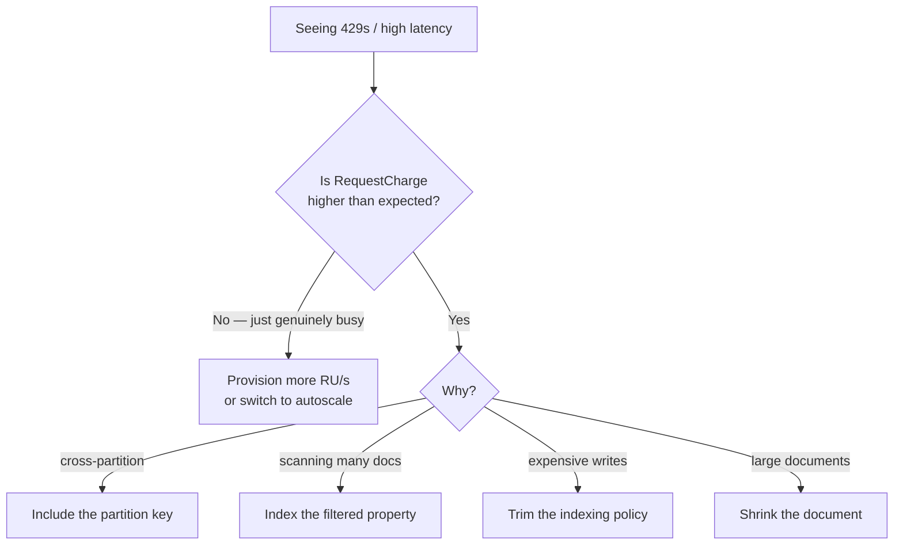

# Databases · Cosmos DB · Request Units (RU/s) — a slow, example-first walkthrough

> **In Cosmos, performance and cost are the same number.** This is where "a bad design costs money,
> not just milliseconds" becomes concrete.
>
> **Where this sits:** Technology `Databases` → Main topic `Cosmos DB` → Sub topic `Request Units`.
> Prerequisites: [`../Fundamentals/Fundamentals.md`](../Fundamentals/Fundamentals.md) ·
> [`../PartitionKeys/PartitionKeys.md`](../PartitionKeys/PartitionKeys.md).
> Runnable code: [`RuCost.cs`](RuCost.cs) · [`ThroughputBudget.cs`](ThroughputBudget.cs) ·
> [`RequestUnitsDemo.cs`](RequestUnitsDemo.cs).

---

## 1. WHO — who cares about RU/s?
- **Who needs it:** every Cosmos developer *and* whoever owns the Azure bill — because they're **the
  same number**. There is no separate "performance" and "cost" conversation.
- **Who sets it:** **you** provision it on the container (or database); Azure enforces it every second.

> 🧠 In SQL Server a wasteful query costs **time**. In Cosmos it costs **time *and* money**, every time
> it runs.

## 2. WHAT — what is a Request Unit?

**One sentence:** an **RU** is Cosmos's normalized unit of work — one number bundling the CPU, memory,
and disk IOPS an operation consumed.

### The anchor to memorize
> **1 RU = reading one 1 KB document by point read.**

| Operation | Roughly | Why |
|---|---|---|
| **Point read** (1 KB, `id` + partition key) | **1 RU** | the baseline — cheapest thing in Cosmos |
| **Write / upsert** (1 KB) | **~5+ RU** | writes the doc **and updates every index** |
| **Delete** | ~5 RU | also touches indexes |
| **Single-partition query** | a few RU, scales with docs examined | one machine |
| **Cross-partition query** | far more — multiplied by partitions | every machine works |

Two consequences fall straight out:
1. **Writes cost ~5× reads** — Cosmos indexes **every property by default**, so a write updates the
   document *plus* all those indexes. (→ §2.3.3 Indexing policy.)
2. **Queries are priced by work done, not rows returned.** Scanning 10,000 docs to return 1 is
   expensive: *you pay for the searching, not the finding* — exactly like logical reads in SQL.

### RU vs RU/s
| Term | What | Analogy |
|---|---|---|
| **RU** | price tag of *one* operation | cost of one item |
| **RU/s** | how many you may spend *per second* | your **speed limit** |

Exceed your RU/s in a given second and Cosmos rejects the excess:
```
429 Too Many Requests   (+ a retry-after hint in ms)
```

> 🧠 **429 is not a bug in your code — it's Cosmos saying "you exceeded the speed limit you paid for."**
> The SDK auto-retries (9 times by default) honouring `retry-after`, so you usually don't see errors —
> **you see latency.** A 429 storm looks like mysterious slowness.

Finding it: **Azure Monitor → *Normalized RU Consumption*** (pinned at 100% = throttling) and
***Throttled Requests***; or inspect `response.Diagnostics`.

```csharp
var client = new CosmosClient(conn, new CosmosClientOptions
{
    MaxRetryAttemptsOnRateLimitedRequests = 9,
    MaxRetryWaitTimeOnRateLimitedRequests = TimeSpan.FromSeconds(30),
});
```

### The three ways to buy throughput
| Mode | How | Best for |
|---|---|---|
| **Provisioned (manual)** | fixed number, e.g. 400 RU/s, paid 24/7 | steady, predictable load |
| **Autoscale** | set a *max*; Azure scales between 10% and 100% of it | spiky / unpredictable load |
| **Serverless** | no provisioning; pay per request | dev/test, low or intermittent traffic |

Minimum for a manual container is **400 RU/s**. Throughput can be **per container** (dedicated) or
**shared across a database** (cheaper for many small containers, but they compete for one pool).

### The one line that makes it all visible
```csharp
var response = await container.ReadItemAsync<Order>("order-1", new PartitionKey("10"));
Console.WriteLine($"cost: {response.RequestCharge} RU");
```
> 🧠 **`RequestCharge` is to Cosmos what logical reads are to SQL Server.** Log it, watch it, and be
> suspicious when it moves.

## 3. WHY — why does an operation cost what it costs?

### Why writes cost ~5× reads
- **Indexes.** Every property is indexed by default, so a write updates the document *and* an index
  entry per property. A point read touches one document at a known address — no index maintenance.
- **Replication.** A write isn't done until durably committed to several replicas; a read can be
  served by one.

> 🧠 **Reads are cheap because they touch one thing; writes are expensive because they touch many.**

### Why a query returning 1 document can cost 800 RU
It **examined thousands to find one**. The three usual culprits:

| Cause | Signature | Fix |
|---|---|---|
| **Cross-partition fan-out** | filter lacks the partition key | add it, or reconsider the key |
| **Unindexed property** | excluded in the indexing policy | index it |
| **Function/computed filter** | `WHERE UPPER(c.email) = …` | keep the property bare |

> ⚠️ That last one is **the same rule as SQL indexing** — indexes are built on raw values, so wrapping a
> property in a function defeats them. The instinct transfers directly.

> 🧠 **High RU + few results = you scanned a lot to find a little.** That's the diagnosis, every time.

## 4. HOW — the practical levers
| Lever | Effect |
|---|---|
| **Point reads instead of queries** where possible | 1 RU vs potentially hundreds |
| **Include the partition key** in every hot query | avoids fan-out |
| **Trim the indexing policy** (exclude never-filtered properties) | cheaper writes |
| **Keep documents small** | RU scales with size |
| **`SELECT` only needed fields** | less data marshalled |
| **Autoscale** for spiky load | avoids 429s without paying peak 24/7 |
| **`TransactionalBatch`** within a partition | fewer round trips |

## 5. The runnable model in this repo

[`RuCost.cs`](RuCost.cs) prices operations (**illustrative numbers — the *ratios* are the lesson**;
in real code you read `RequestCharge`), and [`ThroughputBudget.cs`](ThroughputBudget.cs) enforces a
provisioned RU/s budget, counting 429s.

```powershell
dotnet run --project src/BackendArchitect -c Release
```
```
What operations cost (RU):
  point read, 1 KB                        :    1.0   <- the anchor
  write, 1 KB, 8 indexed properties       :    9.0   <- ~9x a read
  write, 1 KB, 2 indexed properties       :    6.0   <- trimmed policy
  query, 1 partition, 5 docs examined     :    2.1
  query, 4 partitions, 1000 docs examined :   28.0   <- fan-out + scanning

Provisioned 400 RU/s; workload = 60 writes in one second:
  full indexing: consumed 396.0 RU -> 16 requests got 429 (retried -> latency)
  trimmed index: consumed 360.0 RU -> no throttling
  -> same workload; the only change was how much each write costs.
```

**Read those last three lines again.** Identical workload, identical provisioning — the *only* change
was making each write cheaper, and throttling disappeared. That is the entire RU skill in one
experiment: **you can always buy more RU/s, or you can make the operation cost less.** Knowing which to
reach for is the engineering judgment.



---

## Recap in one breath
An **RU** is one normalized unit of work; **1 RU = a 1 KB point read**. Writes cost **~5×** because they
update **every index**; queries are priced by **work done, not rows returned**. You provision **RU/s**
(manual, autoscale, or serverless), and exceeding it returns **429**, which the SDK retries — so
throttling shows up as **latency, not errors**. Measure everything with **`RequestCharge`**, and when
it's too high, either **provision more** or **make the operation cheaper**.

> 🧠 **RU = the price tag. RU/s = the speed limit. `RequestCharge` = the receipt.**

## Warm-up questions
1. Why does a write cost roughly 5× a point read? (two reasons)
2. A query returns 1 document but costs 800 RU — what's happening, and what are the three usual causes?
3. What is a 429, and why might you never see one in your logs even though it's happening?
4. When should you provision more RU/s rather than optimise the operation?
