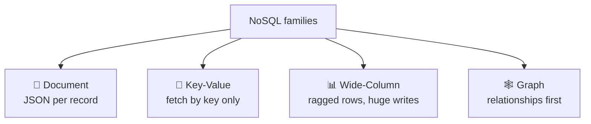
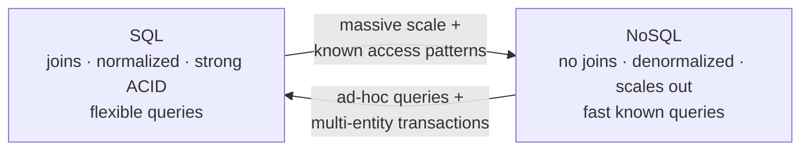
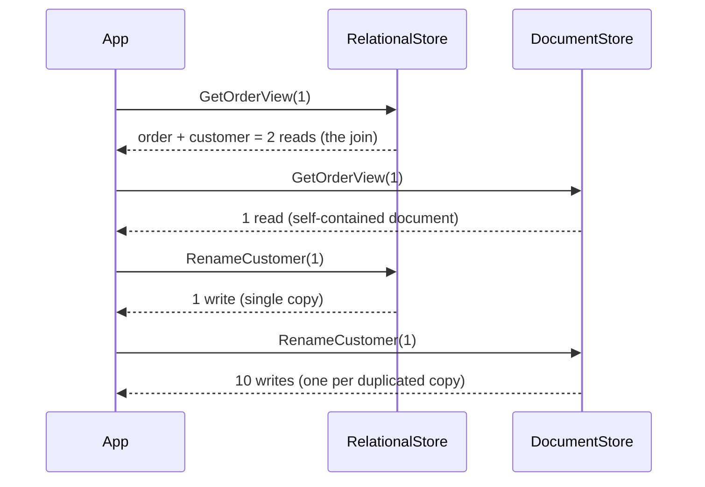

# Databases · NoSQL · Concepts — a slow, example-first walkthrough

> **How to read this:** same order — **Who → What → Why → When → Where → How.**
> **Where this sits:** Technology `Databases` → Main topic `NoSQL` → Sub topic `Concepts`.
> Runnable code: [`RelationalStore.cs`](RelationalStore.cs) · [`DocumentStore.cs`](DocumentStore.cs) ·
> [`NoSqlConceptsDemo.cs`](NoSqlConceptsDemo.cs).
> Builds on [`../../SQL/DataModeling/DataModeling.md`](../../SQL/DataModeling/DataModeling.md).
> Leads into **§2.3 Cosmos DB**.

---

## 1. WHO — who cares?
- **Who needs it:** anyone choosing *where* data lives — an **architect decision**, expensive to undo.
- **Who created it, and why:** Google/Amazon/Facebook-scale pressure — data across *thousands* of
  machines, traffic no single server could hold.

> 🧠 NoSQL wasn't invented because SQL is bad, but because at extreme **scale** and **flexibility**
> some of SQL's guarantees become too expensive to keep.

## 2. WHAT — what is NoSQL?
Databases that **relax some relational rules** (fixed schemas, joins, strong consistency) in exchange
for **scale, flexibility, and speed**.

Two myths to kill first:

| Myth | Truth |
|---|---|
| "No SQL language" | **"Not Only SQL."** Cosmos DB's main API uses SQL-like queries. |
| "No schema" | The schema lives in **your application code** — **schema-on-read** vs SQL's **schema-on-write**. |

> 🧠 The schema doesn't disappear — **responsibility for it moves from the database to you.**

### The four families
| Family | Shape | Use for | Examples |
|---|---|---|---|
| 📄 **Document** | a JSON doc per record, nested data embedded | general app data, catalogs, profiles | **Cosmos DB**, MongoDB |
| 🔑 **Key-Value** | key → opaque value; fetch by key only | cache, sessions, counters | Redis |
| 📊 **Wide-Column** | rows with ragged/differing columns, huge writes | time-series, IoT, logs | Cassandra, HBase |
| 🕸️ **Graph** | nodes + edges; relationships are the query | social, recommendations, fraud | Neo4j, Cosmos Gremlin |



> 🧠 **Document** = a *file* per thing · **Key-Value** = a *locker* · **Wide-Column** = a *spreadsheet
> with ragged rows* · **Graph** = a *map of connections*.

## 3. WHY — why give up joins and schemas?

### Why 1 — dropping joins buys horizontal scale
- **Scale up (vertical):** a bigger server. Has a ceiling, gets expensive. SQL's traditional path.
- **Scale out (horizontal):** more cheap machines. No ceiling. What NoSQL is built for.

With data across 100 machines, a `JOIN` must drag rows **across the network** mid-query, and it gets
*worse* as you add machines.

> 🧠 **The bargain: give up cross-machine joins, and every query can be answered by ONE machine** — so
> adding machines *helps* instead of hurting.

### Why 2 — so you denormalize by default
Can't join → **store together what you read together**.

| | SQL | NoSQL |
|---|---|---|
| **Model around** | the *data* (each fact once) | the **queries** (what you read together) |
| **Default** | normalize (3NF) | **denormalize** |
| **Design question** | "what *is* this data?" | "**how will I read it?**" |

> 🧠 The sentence that matters most for Cosmos: **model around your access patterns, not your data.**
> You must know your queries *before* you design.

### Why 3 — the costs (be honest)
- 🔴 **Duplication → the update anomaly is back.** Name copied into 10,000 docs → 10,000 updates.
- 🟠 **Weaker transactions** — usually atomic only within one document/partition.
- 🟡 **Eventual consistency** — replicas may briefly disagree (tunable in Cosmos, §2.3).
- 🔵 **Rigid queries** — a query the model didn't anticipate can be slow or impossible.

> ⚠️ **Don't confuse two look-alikes:** the **update anomaly** (you missed a *copy* — your job to fix)
> vs **eventual consistency** (replicas lagging — fixed by waiting or a stronger consistency level).



### Why 4 — when NOT to use NoSQL
Highly relational data (many-to-many) · unpredictable **ad-hoc queries** (reporting/BI) · strong
**multi-entity transactions** · data that **fits on one server** (most apps).

> ⚖️ **SQL is the sensible default; NoSQL is a deliberate choice for a specific pressure.** Not newer =
> better — a different trade. (Team size is *not* a selection criterion; scale and access patterns are.)

## 4. WHEN
- **Default to SQL**; pick NoSQL under a specific pressure (scale-out, variable shape, hot access pattern).
- **Know your queries first** — can't list your access patterns? You're not ready to model in NoSQL.
- **Polyglot persistence is normal** — SQL for core data + Redis for cache + documents for a catalog.

## 5. WHERE
Document → app data/catalogs · Key-Value → cache/sessions · Wide-Column → telemetry/logs ·
Graph → relationship-first queries.

## 6. HOW — the modeling recipe (the inverse of SQL's)
1. **List access patterns first** ("list orders with the customer's name").
2. **Store together what you read together** → embed.
3. **Embed vs reference:** embed when the child is small, bounded, always read with the parent;
   reference when it's large, unbounded, or shared.
4. **Accept duplication** — then plan *how you'll update the copies*.
5. **Pick a partition key** that spreads load evenly (§2.3).

### The runnable model in this repo
[`NoSqlConceptsDemo.cs`](NoSqlConceptsDemo.cs) runs the same two operations on a normalized store and
a document store, counting items touched:

```powershell
dotnet run --project src/BackendArchitect -c Release
```
```
List 100 orders with the customer's name:
  Normalized (join)   : 200 reads
  Document (embedded) : 100 reads   <- no join, half the work
Rename one customer who has 10 orders:
  Normalized          : 1 write   <- the fact lives once
  Document            : 10 writes  <- every copy must be updated
```

**The trade runs both ways** — documents win the read, normalization wins the write. That symmetry
*is* the lesson.



---

## Recap in one breath
NoSQL = **"Not Only SQL"**: relax schemas/joins/strong consistency to buy **scale-out and flexibility**.
Four families — **document, key-value, wide-column, graph**. Dropping joins is what lets **one machine
answer a query**, which is why it scales; the price is **denormalization** (and the update anomaly),
**weaker transactions**, and **eventual consistency**. So you **model around access patterns, not data**.
**SQL stays the sensible default.** Next: **§2.3 Cosmos DB** — partition keys, RU/s, consistency levels.

## Warm-up questions (answer out loud)
1. Explain to a junior why removing joins makes horizontal scaling possible.
2. Name the four families and one use case each.
3. You denormalize a customer name onto every order — what problem returns, and how is it *different*
   from eventual consistency?
4. Give two situations where NoSQL would be the wrong choice.
