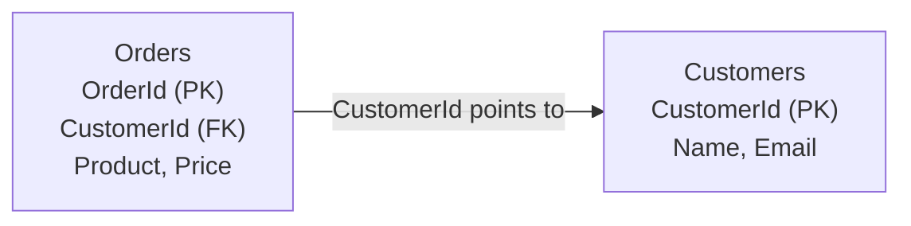
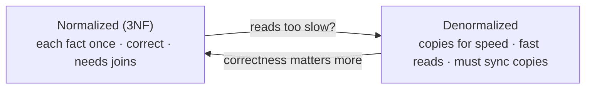

# Databases · SQL · Data Modeling — a slow, example-first walkthrough

> **How to read this:** same order — **Who → What → Why → When → Where → How.**
> **Where this sits:** Technology `Databases` → Main topic `SQL` → Sub topic `Data modeling`.
> Runnable code: [`DataModelingDemo.cs`](DataModelingDemo.cs) · [`FlatOrder.cs`](FlatOrder.cs) ·
> [`Normalized.cs`](Normalized.cs). Leads into **§2.3 Cosmos DB** (modeling for NoSQL).

> **Big idea:** data modeling is the whole activity of structuring data; **normalization is one tool
> inside it**, alongside choosing keys, relationships, data types, and (its counter-move)
> denormalization.

---

## 1. WHO — who cares?
- **Who needs it:** every backend engineer, and it's a core **architect** skill. The model underneath
  shapes everything above it.
- **When you do it:** **early** — migrating a live, multi-million-row database to a new shape is one of
  the riskiest operations in the field, so getting the model right up front has huge leverage.

> 🧠 Data modeling = deciding **what "boxes" your data lives in and how they connect** — before you pour
> any data in.

## 2. WHAT — what is data modeling?
Structuring data into **tables, columns, keys, and relationships** so it's correct, non-redundant, and
efficient. Its heart: **store each fact exactly once.**

### The "one big table" trap
| OrderId | CustomerName | CustomerEmail | Product | Price |
|--|--|--|--|--|
| 1 | Alice | alice@x.com | Latte | 3.50 |
| 2 | Alice | alice@x.com | Muffin | 2.75 |

Alice's email repeats on every order → three **anomalies**:
- 🔴 **Update:** change the email → must fix every row; miss one → inconsistent.
- 🟠 **Insertion:** can't add a customer with no order yet.
- 🟡 **Deletion:** delete her last order → lose her contact info entirely.

### The fix — split into tables linked by keys
**Customers**(<u>CustomerId</u>, Name, Email) &nbsp; **Orders**(<u>OrderId</u>, CustomerId→, Product, Price)

- **Primary Key (PK):** uniquely identifies each row ("who am I") — `CustomerId`, `OrderId`.
- **Foreign Key (FK):** points to another table's PK ("who do I belong to") — `Orders.CustomerId`.



## 3. WHY — normalization, and its counter-move

### The normal forms → one mnemonic
- **1NF** — one value per cell (no lists).
- **2NF** — no *partial* dependency (only relevant with a **composite** key: every column depends on the *whole* key).
- **3NF** — no *transitive* dependency (a non-key column mustn't depend on another non-key column).

> 🧠 **"Every non-key column depends on the key, the whole key, and nothing but the key."**
> Aiming for **3NF** is the sweet spot for ~95% of designs.
> Heuristic: **single-column PK → 2NF cannot be violated**; a non-key column depending on another
> non-key column → **3NF** violation.

### Denormalization (breaking the rules for speed)
Normalization is great for correctness but needs **joins**. Denormalization stores a **redundant copy**
to skip the join:
- ✅ Faster reads (no join). ❌ Re-introduces the update anomaly (must sync copies).
- Do it **only** when a hot read path is measured too slow — never by default.

> 🧠 **Normalize until it hurts; denormalize until it works.**

**Subtlety:** storing `Price` on the order is **not** a violation — it's a **point-in-time fact** (the
price *at purchase*), which must not change when the product's price changes later. Correct modeling,
not redundancy.



## 4. WHEN
- Model **early**; **aim for 3NF** by default.
- **Denormalize only when measured** read performance requires it.
- Think about **access patterns** — crucial for NoSQL/Cosmos (model around the queries).

## 5. WHERE
- **Relational (SQL):** 3NF + foreign keys + constraints (`NOT NULL`, `UNIQUE`).
- **Document/NoSQL (Cosmos):** often denormalize/embed around access patterns + partition key.
- **In code:** `CREATE TABLE` + keys/constraints, or EF Core entities + migrations.

## 6. HOW — a repeatable recipe
1. Find the **entities** (nouns) and **relationships** (one-to-many, many-to-many).
2. Give each a **primary key**.
3. **Normalize to 3NF** — each fact once, linked by foreign keys.
4. Add **constraints** so the database enforces correctness.
5. Many-to-many → a **join table** (`OrderItems(OrderId, ProductId)`).
6. Only then, **denormalize** a hot path if real numbers demand it.

### The runnable model in this repo
[`DataModelingDemo.cs`](DataModelingDemo.cs) runs the same "change Alice's email" on a flat vs a
normalized model:

```powershell
dotnet run --project src/BackendArchitect -c Release
```
```
Flat model : after partial update, Alice has 2 emails -> INCONSISTENT (update anomaly)
Normalized : after one update, every order resolves to 1 email -> consistent
```

---

## Recap in one breath
Data modeling structures data into **tables, keys, and relationships** so each **fact is stored once**.
**Normalization** (aim for **3NF**: depend on *the key, the whole key, and nothing but the key*) removes
the update/insert/delete anomalies; **denormalization** deliberately re-adds redundancy for read speed
when measurements demand it. **PK** = who am I; **FK** = who I belong to. Next: **§2.3 Cosmos DB** —
modeling for a document/NoSQL world.

## Warm-up questions (answer out loud)
1. Name the three anomalies and what causes them.
2. `Orders(OrderId, CustomerId, CustomerCity)` — which normal form is violated and why? (watch the 2NF trap)
3. When is duplication *correct* modeling rather than a normalization violation?
4. What do you trade away when you denormalize?
