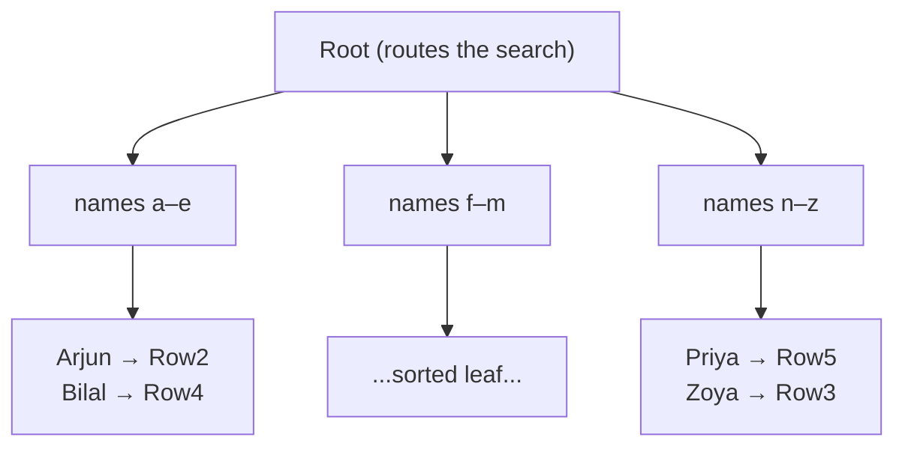
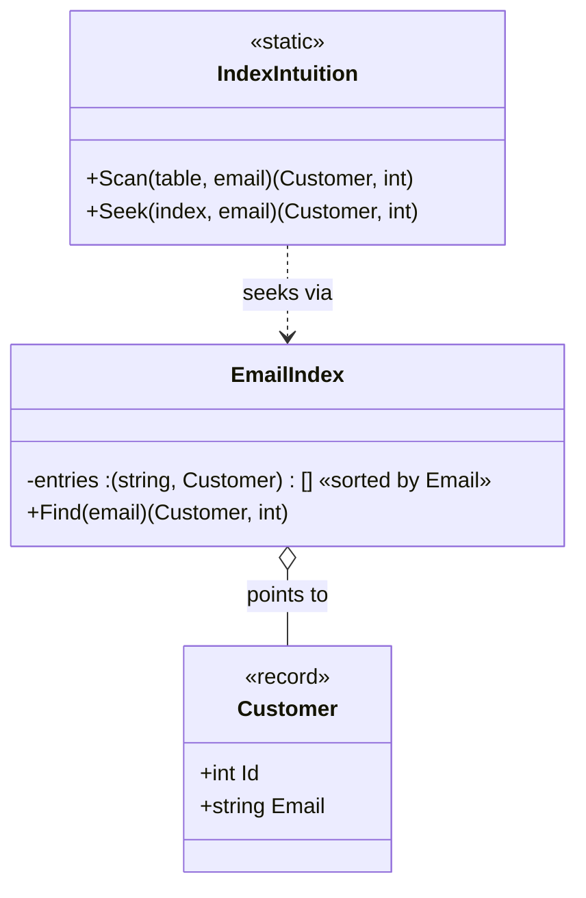
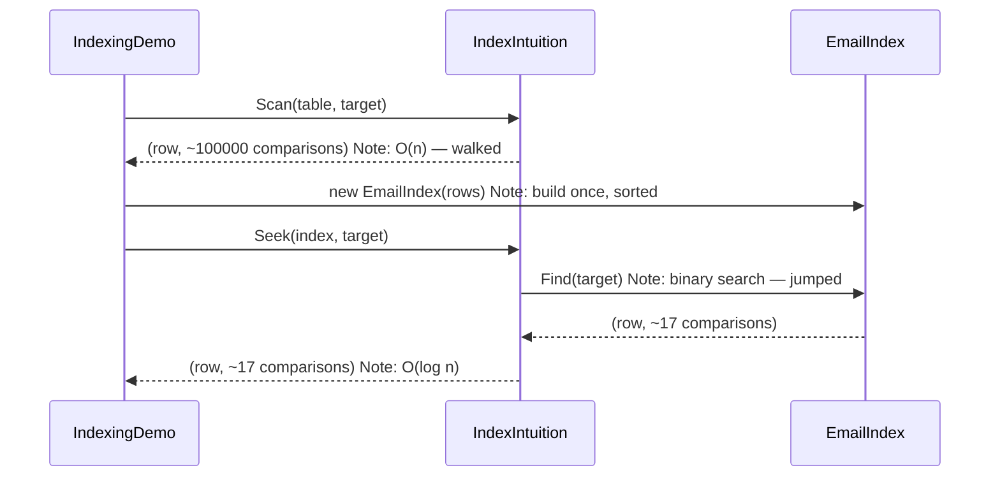

# Databases · SQL · Indexing — a slow, example-first walkthrough

> **How to read this:** we go in order — **Who → What → When → Where → Why → How.**
> Each part has tiny examples that build on the one before. Don't rush. By the end you'll be able to
> explain an index to someone else, which is the real test.
>
> **Where this sits:** Technology `Databases` → Main topic `SQL` → Sub topic `Indexing`.
> Runnable code: [`IndexIntuition.cs`](IndexIntuition.cs) + [`IndexingDemo.cs`](IndexingDemo.cs).
> SQL to run: [`indexing-playground.sql`](indexing-playground.sql).
> Next sub topic: [`../QueryPlans/QueryPlans.md`](../QueryPlans/QueryPlans.md).

---

## 1. WHO — who is this for, and who actually *uses* the index?

- **Who should learn it:** every backend engineer. The moment your app talks to a database, indexing
  is the #1 thing that decides whether a page loads in 20 milliseconds or 20 seconds.
- **Who uses an index at runtime:** *not you directly.* You **create** an index once, then the
  **database's query planner** decides on its own whether to use it for each query. Your job is to
  (a) create the right index and (b) write queries the planner *can* use it for.

> Think of yourself as the person who **builds the phone book**. The **database** is the person who
> **looks names up in it**.

---

## 2. WHAT — what is an index?

**One sentence:** *an index is a sorted copy of one (or a few) columns, kept alongside the table, with
a pointer back to each full row.*

### Example 1 — a tiny phone book (start here)

Imagine a `Friends` table. The rows are stored in the order you added them — **no order at all** by name:

| Row # | Name  | Phone |
|------|-------|-------|
| 1 | Meera | 111 |
| 2 | Arjun | 222 |
| 3 | Zoya  | 333 |
| 4 | Bilal | 444 |
| 5 | Priya | 555 |
| 6 | Kabir | 666 |

Now: *"find Priya's phone."* With no index you start at row 1 and check every row until you hit Priya
at row 5. You **read 5 rows** to find 1.

An **index on Name** is a second little list, kept **sorted by name**, each pointing back to its row:

| Name (sorted) | → points to |
|------|------|
| Arjun | Row 2 |
| Bilal | Row 4 |
| Kabir | Row 6 |
| Meera | Row 1 |
| Priya | Row 5 |
| Zoya  | Row 3 |

Because it's sorted, you can **jump** instead of walk. That jumping is the whole idea.

### Example 2 — a real-world analogy you already know

A **textbook**. The pages are in *chapter* order (that's the table). At the back there's an **index**:
words in *alphabetical* order, each with a page number. You never read the whole book to find "photosynthesis"
— you flip to the index, find the word, jump to the page. Same mechanism, exactly.

### What an index is **not**
- It is **not** the table. The table still exists; the index just points into it.
- It is **not** free — it's a real, separate structure taking real space (more in *Why*).

---

## 3. WHY — why is it so much faster? (and what does it cost?)

### Example 3 — feel the numbers

Finding one name by **walking every row** (a "scan") vs **jumping in a sorted list** (a "seek"):

| Rows in table | Scan (read every row) | Seek (jump in sorted index) |
|---|---|---|
| 10 | ~10 checks | ~4 checks |
| 1,000 | ~1,000 checks | ~10 checks |
| 1,000,000 | ~1,000,000 checks | ~20 checks |
| 1,000,000,000 | ~1,000,000,000 checks | ~30 checks |

See the pattern? When the table gets **1000× bigger**, the scan gets **1000× slower**, but the seek
only adds **~10 more checks**. That is the difference between **O(n)** (grows with the data) and
**O(log n)** (barely grows). This is *the* reason indexes exist.

### Example 4 — see it run on your machine

[`IndexIntuition.cs`](IndexIntuition.cs) models exactly this (as a simple analogy, not real database
internals) and counts "comparisons" as a stand-in for how much work the database did:

```powershell
dotnet run --project src/BackendArchitect -c Release
```
```
Table size            : 100,000 rows
Full SCAN comparisons : 100,000   (O(n))     <- walked every row
Index SEEK comparisons: 17        (O(log n)) <- jumped
Speed-up              : ~5,882x fewer reads
```

### The cost — why you don't index every column
An index is a **sorted copy that must be kept sorted on every change**. So:
- ✅ **Reads get faster.**
- ❌ **Writes get slower** — every `INSERT`/`UPDATE`/`DELETE` must also update each index to keep it sorted.
- ❌ **Storage grows** — each index is real data on disk.

> An index is a **trade**: you spend write-speed and disk to buy read-speed. An index nobody uses is
> pure loss — it costs you and gives nothing back.

---

## 4. WHEN — when to add an index (and when not to)

**Add one when:**
- A column shows up a lot in `WHERE` (e.g. `WHERE Email = ...`), in `JOIN` conditions, or in `ORDER BY`.
- The table is big enough that scans hurt (a 50-row table doesn't need indexes — scanning 50 rows is instant).
- The column is **selective** — it narrows results a lot (an `Email` is very selective; a `Gender`
  column with 2 values is not).

**Don't add one when:**
- The table is tiny.
- The column is written far more than it's searched (you'd pay the write cost for no read benefit).
- The column has very few distinct values (low selectivity) — the index barely narrows anything.

> Rule of thumb: **index the columns you search by, not the columns you only display.**

---

## 5. WHERE — where does an index live, and where does it apply?

- **Where it physically lives:** on disk (and cached in memory), as a **separate structure** next to the
  table — not inside the rows.
- **Where in your query it helps:**
  - `WHERE Email = 'a@b.com'` — equality ✅
  - `WHERE Age BETWEEN 20 AND 30`, `> `, `<`, `ORDER BY`, `LIKE 'a%'` — ranges ✅ (because the index is sorted)
  - `JOIN Orders o ON o.CustomerId = c.Id` — the join column ✅
- **Where it does NOT help:** `LIKE '%abc'` (leading wildcard), or when you wrap the column in a
  function like `WHERE UPPER(Email) = ...` (covered in the *How* section and in
  [QueryPlans.md](../QueryPlans/QueryPlans.md)).

### How it's really stored: a B-tree (a peek, not a deep dive)
A database doesn't keep a flat sorted list (too slow to re-sort on every insert). It uses a **B-tree**:
a short, wide, balanced tree. Data is read from disk in **pages** (~8 KB), so the tree is very wide and
only **3–4 levels deep even for billions of rows** — meaning ~3–4 hops to find anything.



---

## 6. HOW — how to create, use, and level up (step by step)

### Step 1 — create a basic index
```sql
CREATE INDEX IX_Customers_Email ON Customers (Email);
```
Now `WHERE Email = 'amir@x.com'` can **seek** instead of scan.

### Step 2 — check the database actually used it
You never guess — you ask for the **execution plan** and look for **Seek** (good) vs **Scan** (bad on a
big, selective query). Full details in [QueryPlans.md](../QueryPlans/QueryPlans.md). Quick version:
```sql
SET STATISTICS IO ON;   -- SQL Server: also turn on "Include Actual Execution Plan" (Ctrl+M)
SELECT * FROM Customers WHERE Email = 'amir@x.com';
```

### Step 3 — the gotcha that silently kills your index
Wrapping the column in a function forces a **scan** even though the index exists:
```sql
-- ❌ SCAN: the function hides the raw column value from the index
WHERE YEAR(OrderDate) = 2026
-- ✅ SEEK: keep the column bare, move the work to the other side
WHERE OrderDate >= '2026-01-01' AND OrderDate < '2027-01-01'
```
**Rule: keep the indexed column naked on one side of the comparison.**

### Step 4 — composite index (more than one column) + the leftmost-prefix rule
```sql
CREATE INDEX IX_Customers_City_Email ON Customers (City, Email);
```
This is sorted by **City first, then Email** — like a phone book sorted by city, then by name inside
each city.
- `WHERE City = 'Delft' AND Email = '...'` → uses it fully ✅
- `WHERE City = 'Delft'` → uses it (you searched the *first* column) ✅
- `WHERE Email = '...'` (no City) → **can't** use it ❌ — you can't find a name in a city-sorted book
  without knowing the city. This is the **leftmost-prefix rule**: you must use the columns from the
  left, without gaps.

### Step 5 — clustered vs non-clustered (the two kinds)
- **Clustered** = the table's rows are physically *stored* in this order. You get **one** per table (you
  can only sort the pile one way). In SQL Server the primary key is clustered by default.
- **Non-clustered** = the separate sorted list-with-pointers (everything above). You can have many.

### Step 6 — covering index (the pro move)
If the index already contains **every column the query needs**, the database answers from the index
alone and never touches the table — the fastest read there is:
```sql
CREATE INDEX IX_Customers_Covering ON Customers (City) INCLUDE (Email, Phone);
SELECT City, Email, Phone FROM Customers WHERE City = 'Delft';  -- answered entirely from the index
```

### The code, as a picture



---

## Recap in one breath
An index is a **sorted copy of a column with pointers back to the rows**, so the database can **jump**
(seek, O(log n)) instead of **walk** (scan, O(n)). It makes reads fast but writes slower and uses disk,
so index the columns you **search by**. Watch out for **functions on the column** (kills it) and the
**leftmost-prefix rule** on composite indexes. Verify with the **query plan**: Seek good, Scan (on a big
selective query) bad.

## Warm-up questions for tomorrow (answer out loud before we start)
1. In your own words, why is a seek so much faster than a scan on a million rows?
2. You have `CREATE INDEX IX ON Orders (CustomerId, OrderDate)`. Which of these can use it, and why?
   - a) `WHERE CustomerId = 42`
   - b) `WHERE OrderDate > '2026-01-01'`
   - c) `WHERE CustomerId = 42 AND OrderDate > '2026-01-01'`
3. Why does adding an index make `INSERT`s slower?
4. This is slow and scans: `WHERE UPPER(Email) = 'AMIR@X.COM'` (there's an index on `Email`). Why, and how would you fix it?

*(We'll go through these together first thing, then move to a couple of hands-on exercises.)*
