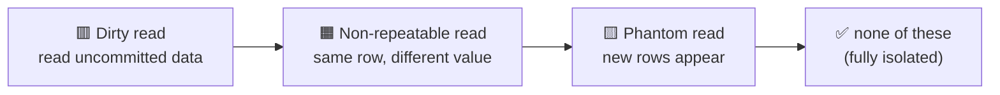
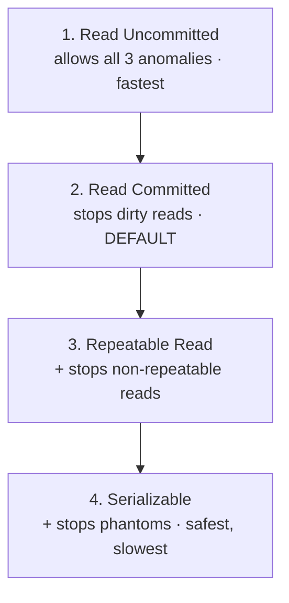
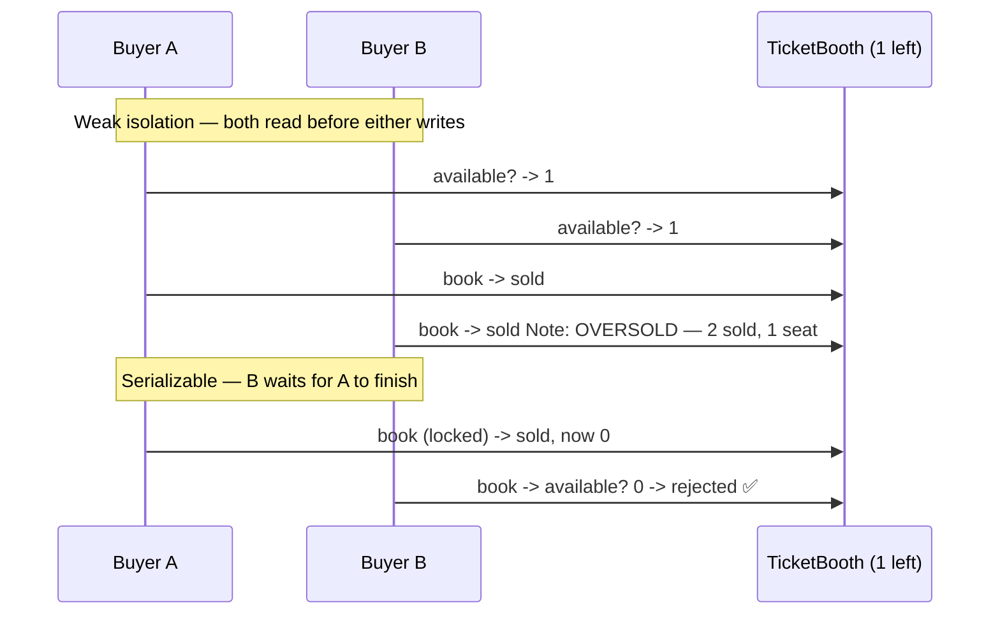

# Databases · SQL · Isolation Levels — a slow, example-first walkthrough

> **How to read this:** same order — **Who → What → Why → (levels) → When → Where → How.**
> **Where this sits:** Technology `Databases` → Main topic `SQL` → Sub topic `Isolation levels`.
> Prerequisite: [`../Transactions/Transactions.md`](../Transactions/Transactions.md) (the **I** in ACID).

> **Anchor idea:** the **I** in ACID means "transactions behave as if they run one at a time." Doing
> that *literally* would be slow (everyone waits in line), so databases give you a **dial**: how
> strictly to enforce that promise. That dial is the **isolation level**.

---

## 1. WHO — who cares about isolation levels?

- **Who needs it:** anyone whose app has **more than one user/request touching the same data at once**
  — i.e. every real app. These bugs are **intermittent**: fine in testing (one user), broken in
  production under load (many at once).
- **Who sets it:** **you** pick the level (the dial); the **database enforces** it. Each database has a
  **default** (SQL Server: *Read Committed*), tunable per transaction.

> 🧠 You're choosing **how private your workspace is** while touching shared data — from "anyone can
> peek at my half-done work" to "completely sealed off, as if I'm alone."

---

## 2. WHAT — what is an isolation level?

**One sentence:** it controls **how much one transaction can see of other transactions' unfinished
(uncommitted, in-progress) work.**

A **trade-off dial**:

| Turn toward… | You get… | But… |
|---|---|---|
| **Stricter** | More correctness / safety | Slower — transactions wait for each other more |
| **Looser** | More speed / concurrency | Risk of reading wrong/inconsistent data |

*(The speed-vs-correctness result is the **consequence**; the thing the dial actually sets is **how much
peeking is allowed**.)*

### Example — the concert ticket
1 ticket left, two buyers at the same millisecond:
- **Loose:** both read "1 available," both commit → **2 sold, 1 seat** 💥 oversold.
- **Strict:** the second transaction **waits**, then sees "0 left" and fails cleanly ✅.

Same code, same data — **only the dial changed.**

---

## 3. WHY — the three read anomalies (what goes wrong when you loosen the dial)

Using a `Balance = 100` row and two transactions **T1**, **T2**:

### 🟥 Dirty read — reading someone's *uncommitted* work
```
T1: BEGIN; UPDATE Balance = 500      (not committed)
T2: READ Balance -> 500              (reads T1's uncommitted change)
T1: ROLLBACK                         (Balance is 100 again)
T2: acted on 500, which NEVER existed
```
Worst anomaly — you acted on data that got rolled back.

### 🟧 Non-repeatable read — the *same row* changes under you
```
T1: READ Balance -> 100
T2: UPDATE Balance = 20; COMMIT
T1: READ Balance again -> 20         (same query, different answer, in ONE transaction)
```

### 🟨 Phantom read — *new rows* appear under you
```
T1: SELECT COUNT(*) WHERE Amount > 50 -> 3
T2: INSERT a row with Amount = 90; COMMIT
T1: same query again -> 4            (a "phantom" row appeared)
```
The concert-ticket oversell is essentially a phantom.



> 🧠 Memory hook: **Dirty** = *never committed* · **Non-repeatable** = *value changed* ·
> **Phantom** = *rows appeared*.

---

## 4. The four isolation levels (which anomaly each stops)

Four notches on the dial, loosest → strictest; each turns off one more anomaly.

1. **Read Uncommitted** — can read others' *uncommitted* changes. All three anomalies possible. Almost never used on purpose.
2. **Read Committed** — reads only *committed* data → **no dirty reads**. Default in SQL Server / PostgreSQL / Oracle. Good balance.
3. **Repeatable Read** — rows you've already read can't change → **no dirty, no non-repeatable**. New rows (phantoms) can still appear.
4. **Serializable** — result is *as if transactions ran one at a time* → **no anomalies at all**. Safest, slowest.

| Isolation level | Dirty read | Non-repeatable read | Phantom read |
|---|:---:|:---:|:---:|
| **Read Uncommitted** | ⚠️ possible | ⚠️ possible | ⚠️ possible |
| **Read Committed** ← default | ✅ prevented | ⚠️ possible | ⚠️ possible |
| **Repeatable Read** | ✅ prevented | ✅ prevented | ⚠️ possible |
| **Serializable** | ✅ prevented | ✅ prevented | ✅ prevented |

> 🧠 A **staircase**: each level down prevents everything the one above did **plus one more** anomaly —
> while costing more concurrency. Loosest+fastest at the top, strictest+safest at the bottom.



**Footnote — Snapshot Isolation (MVCC):** many databases also offer snapshot isolation — each
transaction reads a consistent *snapshot* as of when it began, instead of locking. It's PostgreSQL's
real default behaviour and a SQL Server option. Covered properly in the distributed-systems month; the
four-level table is the foundation.

## 5. WHEN — choosing a level
- **Default to Read Committed** — right for most queries.
- **Stricter only for a specific invariant:** Repeatable Read when a transaction must re-read the same
  rows consistently; Serializable when phantoms are unacceptable (no double-booking / oversell).
- **Read Uncommitted almost never** — only rough analytics where a slightly-wrong number is fine.
- **Rule:** use the **loosest level that's still correct** — every notch stricter costs concurrency.

## 6. WHERE — where you set it (.NET & SQL)
```sql
SET TRANSACTION ISOLATION LEVEL SERIALIZABLE;   -- T-SQL, before BEGIN TRAN
```
```csharp
using var tx = connection.BeginTransaction(IsolationLevel.Serializable);        // ADO.NET
using var tx = context.Database.BeginTransaction(IsolationLevel.RepeatableRead); // EF Core
```
> ⚠️ Gotcha: `TransactionScope` defaults to **Serializable** — usually stricter than you want. Set it explicitly.

## 7. HOW — using it well (+ runnable demo)
1. Choose the level, set it when you **begin** the transaction, keep the transaction **short**.
2. At stricter levels the DB may **abort** a transaction to preserve isolation (serialization failure /
   deadlock) → wrap it in a **retry**: catch the failure, run the whole transaction again.

### The runnable model in this repo
[`TicketBooth.cs`](TicketBooth.cs) models the oversell: booking is a "check-then-act" with a gap
between reading availability and decrementing it. [`IsolationLevelsDemo.cs`](IsolationLevelsDemo.cs)
sends 10 buyers at 1 ticket, with the dial **off** (no lock) vs **on** (a lock = Serializable).

```powershell
dotnet run --project src/BackendArchitect -c Release
```
```
Scenario: 1 ticket left, 10 buyers click 'book' at the same instant.
  Weak isolation (no lock)  -> sold 9 of 1 -> OVERSOLD (bug)
  Serializable (locked)     -> sold 1 of 1 -> correct
```



---

## Recap in one breath
An isolation level is a **dial** setting **how much of another transaction's unfinished work you can
see**. Loosen it and three anomalies appear — **dirty read** (uncommitted data), **non-repeatable read**
(a value changed), **phantom read** (rows appeared). The four levels form a **staircase** —
Read Uncommitted → Read Committed (default; stops dirty) → Repeatable Read (+ stops non-repeatable) →
Serializable (+ stops phantoms) — each safer but less concurrent. Pick the **loosest level that's still
correct**. Next: **2.1.5 Data modeling**.

## Warm-up questions for tomorrow (answer out loud first)
1. What does the isolation-level dial actually control (not just the trade-off)?
2. Name the three anomalies and, in a few words, what each one means.
3. Match: "counted 3 orders, ran the same count, got 4" · "read €500 that was later rolled back" ·
   "read a price twice in one transaction and it changed."
4. How do Isolation and Consistency work together in the concert-ticket case?
