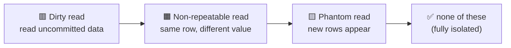

# Databases · SQL · Isolation Levels — a slow, example-first walkthrough

> 🚧 **Work in progress** — filled so far: **Who, What, Why (the three read anomalies).**
> Coming next session: **the four isolation levels** (which anomaly each one stops), **When, Where,
> How** + a runnable demo and tests.
>
> **How to read this:** same order — **Who → What → Why → (levels) → When → Where → How.**
> **Where this sits:** Technology `Databases` → Main topic `SQL` → Sub topic `Isolation levels`.
> Prerequisite: [`../Transactions/Transactions.md`](../Transactions/Transactions.md) (the **I** in ACID).

> **Anchor idea:** the **I** in ACID means "transactions behave as if they run one at a time." Doing
> that *literally* would be slow (everyone waits in line), so databases give you a **dial**: how
> strictly to enforce that promise. That dial is the **isolation level**.

---

## 1. WHO — who cares about isolation levels?

- **Who needs it:** anyone whose app has **more than one user/request touching the same data at once**
  — i.e. every real app. These bugs are **intermittent**: fine in testing (one user), broken in
  production under load (many at once).
- **Who sets it:** **you** pick the level (the dial); the **database enforces** it. Each database has a
  **default** (SQL Server: *Read Committed*), tunable per transaction.

> 🧠 You're choosing **how private your workspace is** while touching shared data — from "anyone can
> peek at my half-done work" to "completely sealed off, as if I'm alone."

---

## 2. WHAT — what is an isolation level?

**One sentence:** it controls **how much one transaction can see of other transactions' unfinished
(uncommitted, in-progress) work.**

A **trade-off dial**:

| Turn toward… | You get… | But… |
|---|---|---|
| **Stricter** | More correctness / safety | Slower — transactions wait for each other more |
| **Looser** | More speed / concurrency | Risk of reading wrong/inconsistent data |

*(The speed-vs-correctness result is the **consequence**; the thing the dial actually sets is **how much
peeking is allowed**.)*

### Example — the concert ticket
1 ticket left, two buyers at the same millisecond:
- **Loose:** both read "1 available," both commit → **2 sold, 1 seat** 💥 oversold.
- **Strict:** the second transaction **waits**, then sees "0 left" and fails cleanly ✅.

Same code, same data — **only the dial changed.**

---

## 3. WHY — the three read anomalies (what goes wrong when you loosen the dial)

Using a `Balance = 100` row and two transactions **T1**, **T2**:

### 🟥 Dirty read — reading someone's *uncommitted* work
```
T1: BEGIN; UPDATE Balance = 500      (not committed)
T2: READ Balance -> 500              (reads T1's uncommitted change)
T1: ROLLBACK                         (Balance is 100 again)
T2: acted on 500, which NEVER existed
```
Worst anomaly — you acted on data that got rolled back.

### 🟧 Non-repeatable read — the *same row* changes under you
```
T1: READ Balance -> 100
T2: UPDATE Balance = 20; COMMIT
T1: READ Balance again -> 20         (same query, different answer, in ONE transaction)
```

### 🟨 Phantom read — *new rows* appear under you
```
T1: SELECT COUNT(*) WHERE Amount > 50 -> 3
T2: INSERT a row with Amount = 90; COMMIT
T1: same query again -> 4            (a "phantom" row appeared)
```
The concert-ticket oversell is essentially a phantom.



> 🧠 Memory hook: **Dirty** = *never committed* · **Non-repeatable** = *value changed* ·
> **Phantom** = *rows appeared*.

---

## 4. The four isolation levels (which anomaly each stops)
> ⏳ *Next session.* Preview — from loosest to strictest: **Read Uncommitted → Read Committed →
> Repeatable Read → Serializable**, each switching off one more anomaly.

## 5. WHEN — choosing a level
> ⏳ *Next session.*

## 6. WHERE — how/where you set it (.NET + SQL)
> ⏳ *Next session.*

## 7. HOW — step by step + runnable demo
> ⏳ *Next session, with a C# demo + tests.*

---

## Recap so far
An isolation level is a **dial** setting **how much of another transaction's unfinished work you can
see**. Loosen it and three anomalies can appear — **dirty read** (uncommitted data), **non-repeatable
read** (a value changed), **phantom read** (rows appeared). The four standard levels (next session) each
turn off more of these, trading speed for correctness.

## Warm-up questions for tomorrow (answer out loud first)
1. What does the isolation-level dial actually control (not just the trade-off)?
2. Name the three anomalies and, in a few words, what each one means.
3. Match: "counted 3 orders, ran the same count, got 4" · "read €500 that was later rolled back" ·
   "read a price twice in one transaction and it changed."
4. How do Isolation and Consistency work together in the concert-ticket case?
