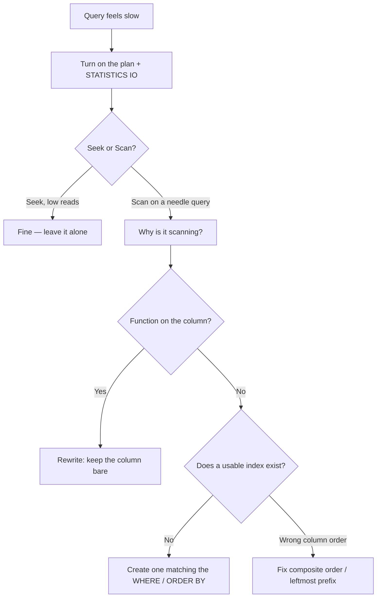

# Databases · SQL · Reading a query plan — a slow, example-first walkthrough

> **How to read this:** same order as indexing — **Who → What → When → Where → Why → How.**
> This is the direct sequel to [Indexing.md](../Indexing/Indexing.md): you created an index, now you
> learn to *prove* the database actually uses it.
>
> **Where this sits:** Technology `Databases` → Main topic `SQL` → Sub topic `Query plans`.
> Hands-on lab: [`../Indexing/indexing-playground.sql`](../Indexing/indexing-playground.sql).

---

## 1. WHO — who cares about query plans?

- **Who needs it:** you, the moment you add an index. An index you *think* helps but doesn't is worse
  than none — it costs writes + storage and gives nothing back. The plan is how you *prove* it works.
- **Who produces the plan:** the **database's query planner / optimizer**. Just like with indexing, the
  database decides on its own how to run each query. The **plan is that decision, written down.**

> 🧠 If indexing was "you build the phone book," the query plan is you **peeking over the database's
> shoulder to see whether it opened the book — or just read every row anyway.**

---

## 2. WHAT — what is a query plan?

**One sentence:** a query plan is the **step-by-step strategy the database chose to answer your query.**
It is a **receipt of what it already did — not advice on what you should do.**

For `SELECT * FROM Friends WHERE Name = 'Priya'`, the database first *decides how*: walk every row
(**scan**) or jump using the index (**seek**). The plan shows you which it picked.

### Example 1 — the two words that matter most: Seek vs Scan

| In the plan you see… | It means… | Phone-book analogy |
|---|---|---|
| **Index Seek** ✅ | Jumped straight to the rows using the index | Flipped to "P" for Priya |
| **Index / Table Scan** ❌ | Read every row and filtered | Read all 6 friends top to bottom |

Reading a plan is mostly hunting for **one word**: **Seek** (good) or **Scan**.

> 🚨 Alarm bell: a **Scan** on a big table for a query that should be *selective* means no usable index,
> or the query defeated the one you have.

### Example 2 — how you ask for it (SQL Server)

```sql
SET STATISTICS IO ON;   -- also press Ctrl+M ("Include Actual Execution Plan")
SELECT * FROM Friends WHERE Name = 'Priya';
```

You get back a small diagram (with "Index Seek" / "Table Scan") **plus** a number called **logical
reads** — the honest "how much work did it do?" measure. (Postgres: `EXPLAIN ANALYZE <query>;`.)

---

## 3. WHY — why does the database sometimes pick a slow Scan even when an index exists?

The most useful part of reading plans. Three everyday reasons:

### Reason 1 — a function wraps the column (the #1 culprit)
```sql
-- ❌ SCAN: index is sorted on the RAW Email; UPPER(Email) is a different, computed value
WHERE UPPER(Email) = 'AMIR@X.COM'
-- ✅ SEEK: keep the column bare
WHERE Email = 'amir@x.com'

-- ❌ SCAN
WHERE YEAR(OrderDate) = 2026
-- ✅ SEEK: bare column + a range does the same job
WHERE OrderDate >= '2026-01-01' AND OrderDate < '2027-01-01'
```
> 🧠 Rule: **keep the indexed column naked on one side of the comparison.** `YEAR(col)`, `UPPER(col)`,
> `col + 1`, and leading-wildcard `LIKE '%x'` all switch the index off.

### Reason 2 — leftmost-prefix rule
Index on `(City, Email)` is sorted by City first.
- `WHERE City = 'Delft' AND Email = '...'` → seek ✅
- `WHERE City = 'Delft'` → seek ✅ (first column)
- `WHERE Email = '...'` (no City) → **scan** ❌ — can't find a name in a city-sorted book with no city.

### Reason 3 — the column isn't selective (and a scan is the *right* call)
Index on `IsActive`, but 90% of rows are `true`:
```sql
WHERE IsActive = true   -- database may Scan ON PURPOSE
```
It's fetching most of the table anyway, so reading straight through beats bouncing through the index.

> 🧠 Big insight: **a Scan is not always a bug. Seek is for needles; Scan is for haystacks.** A scan is
> only a problem when you seek a *needle* (one/few rows) in a *big* table and it scans anyway. Scanning
> to fetch *most* of a table is the database being smart.

---

## 4. WHEN — when do you reach for a plan?
- A query feels slow → get the plan first, *before* guessing or adding random indexes.
- After adding/changing an index → confirm it flipped Scan → Seek and reads dropped.
- Before shipping a query that runs on a big or hot table.

## 5. WHERE — where do you look?
- **In the plan diagram:** read **right-to-left**; find the main data-access box (Seek vs Scan).
- **In the Messages tab:** the **logical reads** number.
- **Across the query:** the `WHERE`, `JOIN`, and `ORDER BY` clauses are what the planner tries to serve
  with an index.

---

## 6. HOW — read a plan, step by step

### Step 1 — turn it on and run
```sql
SET STATISTICS IO ON;   -- + Ctrl+M in SSMS
SELECT * FROM Orders WHERE CustomerId = 42;
```

### Step 2 — find the one word
Main data-access box: **Index Seek** (good) or **Table/Index Scan**? That's 80% of the read.

### Step 3 — trust *logical reads*, not the clock
- **Time** wobbles with load/caching — unreliable.
- **Logical reads** (8 KB pages touched) is **stable and honest** — the true amount of work.
> 🧠 The fix you want to be able to prove: *"logical reads dropped from 50,000 to 4"* — not "it felt
> faster."

### Step 4 — diagnose a bad scan with what you know


### Run the lab
Work through [`../Indexing/indexing-playground.sql`](../Indexing/indexing-playground.sql) block by
block with the actual plan on — watch each query flip between Scan and Seek, and compare the logical
reads printed in the Messages tab.

---

## Recap in one breath
A query plan is the **database's receipt** showing whether it did a **Seek** (jumped, good) or a
**Scan** (walked). A scan on a *needle* query over a *big* table is the alarm — usually a **function on
the column**, a **leftmost-prefix** miss, or a **missing index**. Judge fixes by **logical reads**, not
wall-clock time. And remember: **Seek for needles, Scan for haystacks** — a scan isn't always wrong.

## Warm-up questions (answer out loud)
1. What *is* a query plan — advice, or a receipt? Why does the distinction matter?
2. Index on `OrderDate`; `WHERE YEAR(OrderDate) = 2026` scans. Why, and how do you rewrite it?
3. True/False: "a Scan always means something is wrong." Defend your answer.
4. Why trust *logical reads* over the query's execution time?
