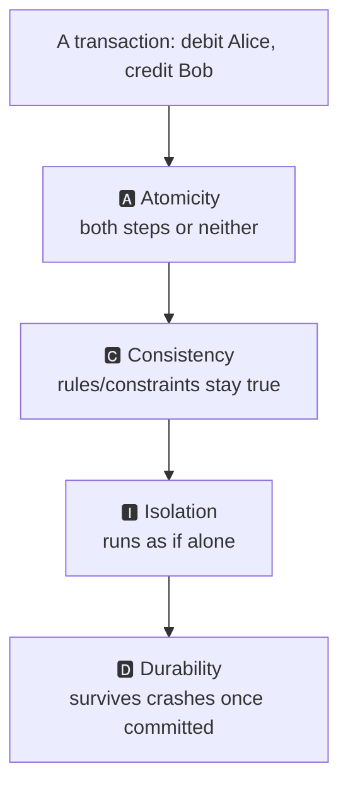
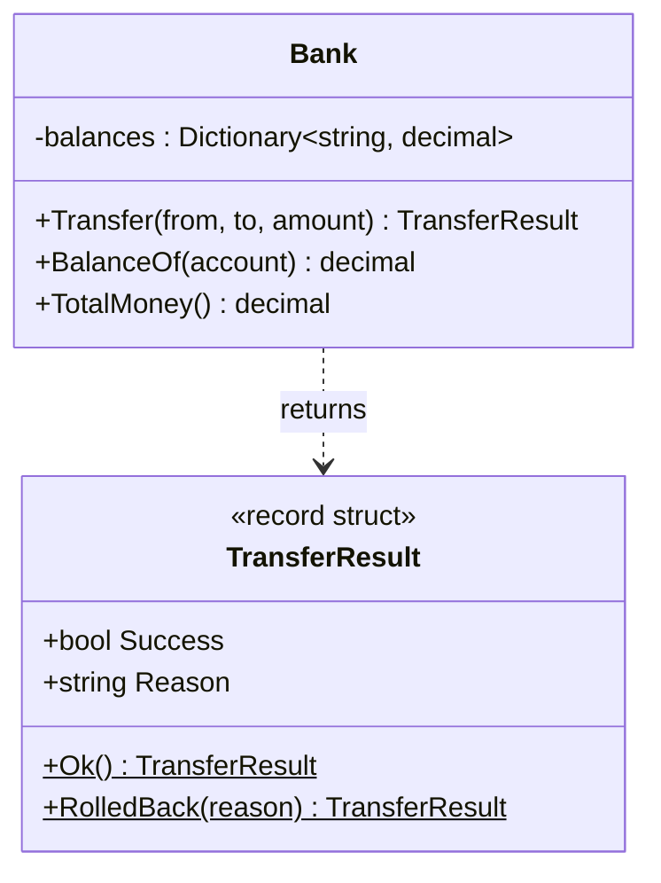
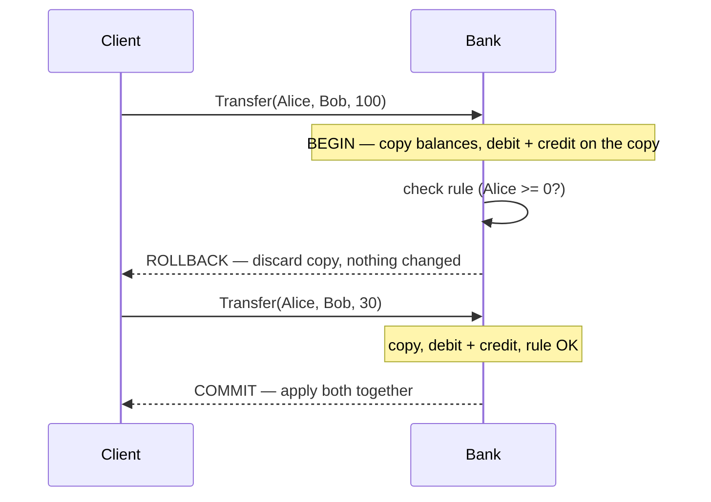

# Databases · SQL · Transactions & ACID — a slow, example-first walkthrough

> **How to read this:** same order as before — **Who → What → When → Where → Why → How.**
> **Where this sits:** Technology `Databases` → Main topic `SQL` → Sub topic `Transactions & ACID`.
> Prerequisite: none. Leads into: [`../` Isolation levels](../) (2.1.4).

---

## 1. WHO — who cares about transactions?

- **Who needs it:** anyone whose app *changes* data — especially money, inventory, bookings. Reading
  data wrong is annoying; *writing* it wrong (losing a payment, double-booking a seat) is a disaster.
  Transactions are the safety net.
- **Who provides it:** the **database** gives transactions as a built-in tool. You just mark "these
  steps belong together," and the database guarantees they behave as one.

> 🧠 A transaction is you telling the database: **"treat these several steps as one all-or-nothing unit
> — either they *all* happen, or *none* of them do."**

---

## 2. WHAT — what is a transaction?

**One sentence:** a transaction is a **group of database operations that succeed together or fail
together — never halfway.**

### Example 1 — the classic: moving money

Transfer €100 from Alice to Bob. That's **two** steps:

```sql
UPDATE Accounts SET Balance = Balance - 100 WHERE Name = 'Alice';   -- step 1
UPDATE Accounts SET Balance = Balance + 100 WHERE Name = 'Bob';     -- step 2
```

If the server **crashes between step 1 and step 2** 💥:
- Step 1 ran → Alice lost €100.
- Step 2 never ran → Bob never got it.
- **€100 vanished.** The books don't balance.

Wrapping both steps in a transaction makes this impossible:

```sql
BEGIN TRANSACTION;
    UPDATE Accounts SET Balance = Balance - 100 WHERE Name = 'Alice';
    UPDATE Accounts SET Balance = Balance + 100 WHERE Name = 'Bob';
COMMIT;   -- both steps become permanent together
```

If the crash happens before `COMMIT`, the database **rolls back** — as if step 1 never happened.
Either *both* updates stick, or *neither* does. **All-or-nothing.**

### Example 2 — the two magic words

- **`COMMIT`** = "I'm done — make all these changes permanent, together."
- **`ROLLBACK`** = "Something went wrong — undo everything since `BEGIN`, as if it never happened."

```sql
BEGIN TRANSACTION;
    UPDATE Accounts SET Balance = Balance - 100 WHERE Name = 'Alice';
    -- oops, Alice would go negative → we don't want this
ROLLBACK;   -- undo it all; Alice's balance is untouched
```

### What a transaction is NOT
- **Not** automatic across statements by default — you *choose* what to group with `BEGIN`/`COMMIT`.
  (A single statement is its own tiny transaction, though.)
- **Not** just for money — any time two+ changes must stay consistent (create an order *and* reduce
  stock), you wrap them.

---

## 3. WHY — the ACID guarantees

"ACID" is four promises a transaction makes. Each shown on the Alice → Bob transfer.

### 🅰️ A — Atomicity ("all-or-nothing")
All steps happen, or none do. Crash after debiting Alice but before crediting Bob → the debit is
**rolled back** too. Never half-done. *(This is the Alice/Bob example above.)*

### 🅲 C — Consistency ("the rules always hold")
A transaction moves the DB from one valid state to another — never an invalid one. Rule: *balance can't
go negative.* Alice has €40, tries to send €100 → the transaction is refused/rolled back so the rule is
never broken. **Constraints, foreign keys, and invariants hold at the end of every transaction.**

### 🅸 I — Isolation ("no stepping on each other")
Concurrent transactions behave as if they ran one at a time. Two transfers touching Alice at the same
instant can't read each other's half-finished work. Isolation has **degrees of strictness** — that's
the entire next sub topic, **2.1.4 Isolation Levels.** For now: *transactions don't see each other's
unfinished work.*

### 🅳 D — Durability ("once done, it stays done")
After `COMMIT`, the change survives a crash/power loss (written to disk via a write-ahead log). Commit,
pull the power cord — on restart, Bob still has his €100.



> 🧠 Memory hook: **A**ll-or-nothing · **C**onstraints hold · **I**solated from others · **D**urable forever.

## 4. WHEN — when to use a transaction
- ✅ Whenever **2+ writes must all succeed or all fail** — transfer money, "create order **and** reduce
  stock," insert into several tables together.
- ❌ Not needed for a **single** statement — it's already atomic by itself.
- ⏱️ Keep them **short**. A transaction holds locks; a long one blocks everyone else. Never do slow work
  (an HTTP call, waiting on a user) *inside* a transaction.

## 5. WHERE — the boundaries
- The boundary is **`BEGIN` … `COMMIT`/`ROLLBACK`**; everything between is one atomic unit.
- In .NET: `using var tx = connection.BeginTransaction();` → `tx.Commit();` / `tx.Rollback();`.
  In EF Core, one `SaveChanges()` is automatically wrapped in a transaction.
- Make the boundary **as small as correctness allows** — wrap only the steps that must be atomic.

## 6. HOW — step by step (+ runnable demo)

```sql
BEGIN TRANSACTION;
    UPDATE Accounts SET Balance = Balance - 100 WHERE Name = 'Alice';
    UPDATE Accounts SET Balance = Balance + 100 WHERE Name = 'Bob';
    -- check a rule (e.g. Alice not negative); if bad -> ROLLBACK
COMMIT;   -- otherwise make both permanent together
```
In real code, wrap it in `try/catch`: commit at the end of the `try`, **rollback in the `catch`** so any
failure undoes everything.

### The runnable model in this repo
[`Bank.cs`](Bank.cs) models a transfer as a transaction: work on a **copy** of the balances, check the
**no-negative** rule, then **commit** both changes together — or **roll back** by discarding the copy.
[`TransactionsDemo.cs`](TransactionsDemo.cs) runs a failing transfer (rolled back, nothing changes) and
a successful one.

```powershell
dotnet run --project src/BackendArchitect -c Release
```
```
Start   : Alice=40.00, Bob=0.00, total=40.00
Send 100: ROLLBACK — Alice has insufficient funds
        : Alice=40.00, Bob=0.00 (unchanged)     <- Atomicity + Consistency
Send 30 : COMMIT
        : Alice=10.00, Bob=30.00, total=40.00    <- money conserved
```





---

## Recap in one breath
A transaction is a **fence around several steps** ending in **`COMMIT`** (keep all) or **`ROLLBACK`**
(undo all), so data is never half-changed. Its four guarantees are **ACID**: **A**tomicity,
**C**onsistency, **I**solation, **D**urability. Use one whenever **multiple writes must stand or fall
together**; keep it **short**. Next: **Isolation levels** — how strictly concurrent transactions are
kept apart.

## Warm-up questions (answer out loud)
1. Give a non-money example where you'd need a transaction, and why.
2. Which ACID letter does "work on a copy, then apply together" demonstrate?
3. Why should a transaction be kept short?
4. How do Isolation and Consistency work together (the concert-ticket case)?
