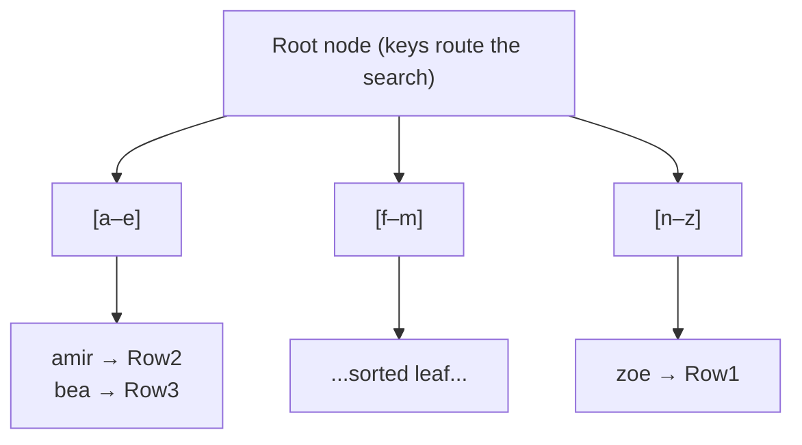
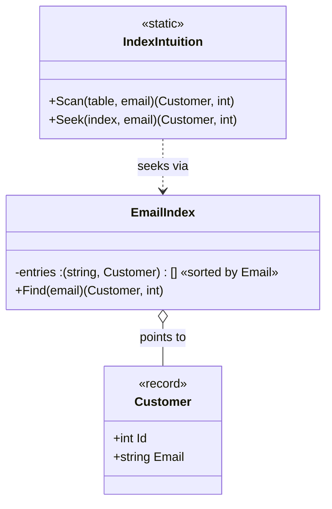
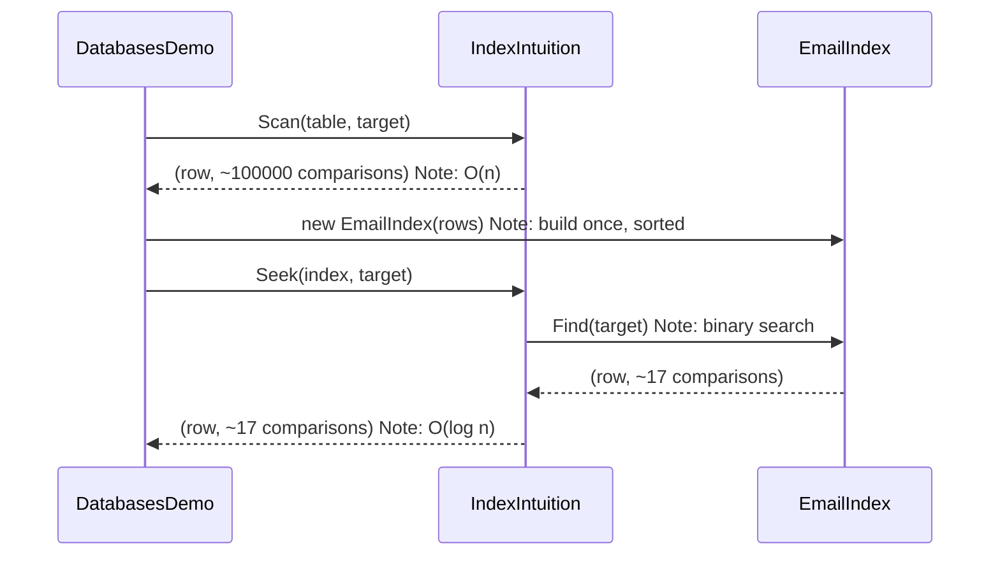

# Month 1 · Lesson 1 — Indexing

> **A table is an unordered pile of rows. An index is a sorted phone book that points into that pile.**

## Why

Without an index, `WHERE Email = 'amir@x.com'` on 10M rows does a **full table scan** — reads every
row, O(n). An index on `Email` keeps the emails **sorted with pointers back to the rows**, so the
database can **binary-search** it — O(log n). 10,000,000 comparisons → ~23.

## What an index is: a B-tree

Not a flat list (too costly to keep sorted on every write) — a **B+ tree**: shallow, wide, balanced.
Disk reads happen in **pages** (~8 KB), so a wide tree stays **3–4 levels deep even for billions of
rows** → ~3–4 page reads to find anything. That "depth barely grows" property is *why* indexes scale.

Because leaves are **sorted**: equality (`=`) is fast **and** ranges (`BETWEEN`, `>`, `ORDER BY`,
`LIKE 'a%'`) are fast — find the start, walk the leaves.

## The runnable model in this repo

[`IndexIntuition.cs`](IndexIntuition.cs) models exactly this idea (as an analogy, not a real B-tree)
and counts **comparisons** as a stand-in for a database's **logical reads** cost signal.

Run it: `dotnet run --project src/BackendArchitect -c Release` — 100k rows, scan ≈ 100,000
comparisons, seek ≈ 17.

## The cost — why not index everything

An index is a **copy of columns kept sorted on every write**:
- Reads faster ✅
- Writes (`INSERT`/`UPDATE`/`DELETE`) slower — every index must be updated ❌
- Storage grows ❌

> Indexing is a **trade**: spend write speed + storage to buy read speed. An **unused index is pure
> loss**.

## Clustered vs non-clustered
- **Clustered** = the rows are physically stored in this order. **One per table** (PK by default in
  SQL Server). It *is* the pile's order.
- **Non-clustered** = the separate sorted phone book with pointers. Many allowed. A `SELECT` of
  columns not in the index triggers a **key lookup** back to the table.

## Composite indexes + covering (the senior move)
`CREATE INDEX IX ON Customers (City, Email)` is sorted by City, then Email.
- `WHERE City = 'Delft' AND Email = '…'` → full use ✅
- `WHERE City = 'Delft'` → uses it (leftmost prefix) ✅
- `WHERE Email = '…'` (no City) → **can't** use it ❌ — **leftmost-prefix rule**

A **covering index** contains every column the query needs → answered from the index, no key lookup →
the fastest read there is.

## Cheat sheet
| Question | Answer |
|---|---|
| Why is my query slow? | Table scan — no usable index |
| What does an index cost? | Slower writes + more storage |
| How many clustered indexes per table? | One — it *is* the row order |
| Why won't `WHERE Email` use my `(City, Email)` index? | Leftmost-prefix rule |
| Fastest possible read? | A covering index (no key lookup) |
