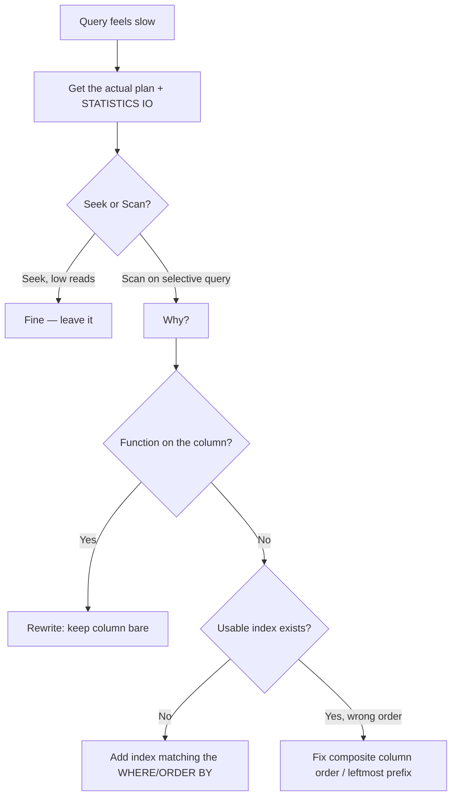

# Month 1 · Lesson 2 — Reading a query plan

> You never *guess* whether an index is used — you make the database **show you its plan**.

## How to get a plan (SQL Server)

```sql
SET STATISTICS IO ON;   -- reports logical reads = the honest cost signal
-- In SSMS: "Include Actual Execution Plan" (Ctrl+M), then run the query.
```

(Postgres: `EXPLAIN ANALYZE <query>;`)

## The two words that matter most: Seek vs Scan

| Operator | Meaning | Analogy |
|---|---|---|
| **Index Seek** ✅ | Navigated the B-tree straight to the rows | Open the phone book to the exact name |
| **Index / Table Scan** ❌ | Read every row/leaf and filtered | Read the whole book cover to cover |

**A Scan on a big table for a query that should be selective = alarm bell.** Missing index, or the
`WHERE` clause defeated the one you have.

Worked through `IX ON Orders (CustomerId, OrderDate)`:
- `WHERE CustomerId = 42` → **Seek** ✅ (leftmost column)
- `WHERE OrderDate > '2026-01-01'` → **Scan** ❌ (dates scattered across every customer; can't jump in)
- `WHERE CustomerId = 42 AND OrderDate > '2026-01-01'` → **Seek + range walk** ✅ (best case)

## The #1 way people accidentally kill an index

Wrapping the indexed column in a **function / math** → forces a scan:

```sql
-- ❌ SCAN — the function hides the raw column value
WHERE YEAR(OrderDate) = 2026
-- ✅ SEEK — keep the column naked, move the work to the other side
WHERE OrderDate >= '2026-01-01' AND OrderDate < '2027-01-01'

-- ❌ SCAN
WHERE UPPER(Email) = 'AMIR@X.COM'
-- ✅ SEEK (with a case-insensitive collation, or store a normalized column)
WHERE Email = 'amir@x.com'
```

Rule: **keep the indexed column bare on one side of the comparison.** Leading-wildcard `LIKE '%x'`
also can't seek.

## Judge cost by logical reads, not wall-clock time

Time fluctuates with cache/load; **logical reads** (pages touched) is stable and honest. The story you
want to be able to tell: *"added the right index → 50,000 logical reads dropped to 4."*



## Takeaway
Run the plan → spot **Seek vs Scan** → a Scan on a selective query means missing/defeated index, most
often a **function on the column**. Trust **logical reads** over time.
