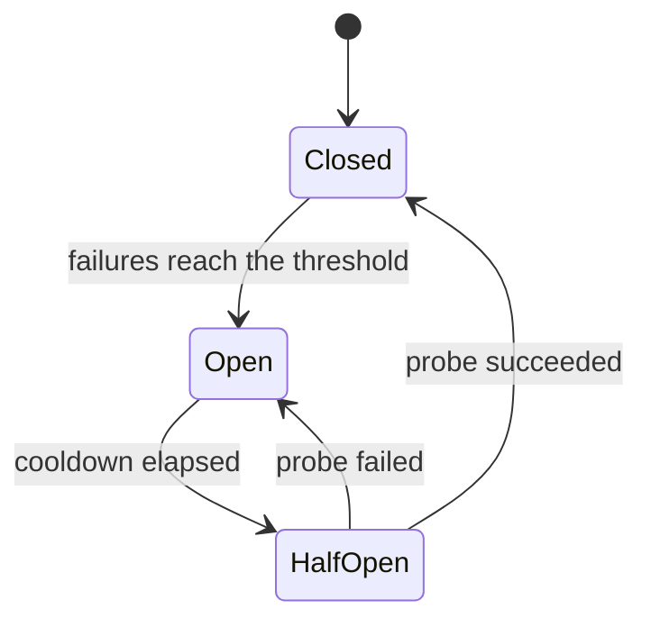

# Reliability · Resilience — a slow, example-first walkthrough

> **The capstone of Month 2.** It pulls together the retry-safety rule from
> [§3.1](../../Apis/Http/Fundamentals/HttpFundamentals.md) and deadline propagation from
> [§3.3](../../Apis/Grpc/Contracts/Grpc.md).
>
> **Where this sits:** Technology `Performance & Reliability` → Main topic `Resilience`.
> Runnable code: [`RetryPolicy.cs`](RetryPolicy.cs) · [`CircuitBreaker.cs`](CircuitBreaker.cs) ·
> [`Bulkhead.cs`](Bulkhead.cs) · [`ResilienceDemo.cs`](ResilienceDemo.cs).

---

## 1. WHY — cascading failure, and why *slow* beats *down* for danger

```
Service C slows to 10s per call
  → B's threads all block waiting on C
  → B stops responding to A
  → A's threads all block waiting on B
  → the whole system is down, because ONE dependency got slow
```

| | **Down** | **Slow** |
|---|---|---|
| Your thread | fails **instantly** → **freed** | **held** for the full duration |
| At 100 req/s | errors, threads available | ~1,000 threads accumulate |
| Your service | degraded but **alive** | thread pool **exhausted** |
| Blast radius | that one feature | **every** endpoint, even unrelated ones |

> 🧠 **Down releases resources; slow consumes them.** *Slow is contagious; down is contained.* A timeout
> is what converts "slow" back into "down" — the failure mode you can actually survive.

## 2. Timeouts — the most important and most neglected

Every remote call needs one. The .NET trap:

```csharp
var client = new HttpClient();                                  // default: 100 SECONDS
var client = new HttpClient { Timeout = TimeSpan.FromSeconds(3) };  // ✅
```

Your user gave up 97 seconds ago; the thread is still held. Choose the value from real data — if p99 is
200 ms, 3 seconds is generous. Waiting 30 s for something that always takes 200 ms is just a slow way to
fail.

## 3. Retries — and how they make outages worse

### They amplify load
```
Normal:     1,000 req/s
Struggling: 1,000 original + 3,000 retries = 4,000 req/s
```
**4× the traffic exactly when the service can least cope** — a self-inflicted DDoS. And it's
self-reinforcing:


That's the **retry storm** (death spiral): once spinning, retry traffic alone keeps the service down
even after the original trigger is gone.

### The thundering herd
A thousand clients fail together, all wait exactly 1 s, and all retry **at the same instant** — hitting
a recovering service with a wall.

```csharp
// ❌ synchronized
delay = baseDelay * Math.Pow(2, attempt);                                    // 1s, 2s, 4s

// ✅ jittered
delay = baseDelay * Math.Pow(2, attempt) * (0.5 + Random.Shared.NextDouble() * 0.5);
```

> 🧠 **Backoff spreads retries out in *time*; jitter spreads them out across *clients*.** You need both —
> and jitter is the half everyone forgets, because it only bites at scale.

Also: **cap attempts** (3, not 10), consider a **retry budget** (retries ≤ 10% of normal traffic), and
never retry a non-idempotent operation without an **idempotency key**.

## 4. Circuit breaker — failing fast on purpose

Named after the breaker in a fuse box: when something keeps failing, **cut the connection** rather than
pushing more current into a fault.

| State | Behaviour |
|---|---|
| 🟢 **Closed** | traffic flows; failures are counted *(closed = working, as in a closed circuit)* |
| 🔴 **Open** | **fails instantly** without calling — no waiting, no thread held |
| 🟡 **Half-Open** | after a cooldown, **exactly one probe** is allowed: success → Closed, failure → Open |



**Half-open is the clever part.** Without it you'd choose between staying Open forever (never
recovering) and reopening the floodgates onto a fragile service. One probe tests recovery at almost no
cost — and only that one call goes through; others are still rejected.

**Two parties benefit:**
1. **You** — fail in microseconds instead of blocking a thread for the timeout
2. **Them** — a struggling service stops being hammered, and often *cannot* recover while under load

> 🧠 **Failing fast is kinder than failing slow** — to your users, your threads, *and* the sick service.
> If the last 20 calls failed, spending 3 seconds to discover that call 21 also fails helps nobody.

## 5. Bulkhead — isolate the damage
Ship compartments: a hole in one must not sink the vessel. Cap concurrency **per dependency**:

```
Payments:        max 20 concurrent
Search:          max 10
Recommendations: max  5   ← it hangs? only 5 threads stuck; checkout unaffected
```

## 6. Fallback — degrade gracefully
Serve a **cached** value, a **default**, or a **partial** response. "Recommendations unavailable" while
checkout still works is worth infinitely more than an error page.

## 7. Polly — the real library

In .NET you don't hand-roll these; you use **Polly** (v8+). Code: [`PollyPipelines.cs`](PollyPipelines.cs) ·
[`PollyDemo.cs`](PollyDemo.cs) · fake dependency [`FlakyPaymentGateway.cs`](FlakyPaymentGateway.cs).

```bash
dotnet add package Polly
```

Polly v8 builds a **resilience pipeline**; strategies wrap the call **outside-in, in the order added**.

### Retry — note the one line people forget
```csharp
new ResiliencePipelineBuilder()
    .AddRetry(new RetryStrategyOptions
    {
        ShouldHandle = new PredicateBuilder().Handle<GatewayUnavailableException>(),
        MaxRetryAttempts = 3,                        // cap it
        Delay = TimeSpan.FromMilliseconds(50),
        BackoffType = DelayBackoffType.Exponential,  // 50ms, 100ms, 200ms
        UseJitter = true,                            // <- avoids the thundering herd
        OnRetry = args => { /* AttemptNumber is 0-BASED */ return default; },
    })
    .Build();
```

### Circuit breaker — compare it with what we built by hand
```csharp
.AddCircuitBreaker(new CircuitBreakerStrategyOptions
{
    FailureRatio = 0.5,                             // = our _failureRatio
    MinimumThroughput = 4,                          // = our _sampleSize (enough evidence first)
    SamplingDuration = TimeSpan.FromSeconds(10),    // = our rolling window, but time-based
    BreakDuration = TimeSpan.FromSeconds(30),       // = our _breakDuration
    OnOpened = ..., OnHalfOpened = ..., OnClosed = ...,
})
```
Almost exactly the model from Exercise 02 — Polly's window is *time*-based rather than *count*-based, and
it raises **`BrokenCircuitException`** when it rejects a call.

### The full pipeline
```csharp
new ResiliencePipelineBuilder<string>()
    .AddFallback(...)                            // 1. outermost: always return something
    .AddTimeout(TimeSpan.FromSeconds(2))         // 2. overall budget for ALL attempts
    .AddRetry(...)                               // 3. retries
    .AddCircuitBreaker(...)                      // 4. breaker, per attempt
    .AddTimeout(TimeSpan.FromMilliseconds(500))  // 5. innermost: per-ATTEMPT timeout
    .Build();
```
Read outside-in: *always return something*, within an overall budget, inside which we retry, each
attempt passing through the breaker, each try bounded by its own timeout.

> ⚠️ **Order matters.** A per-try timeout placed *outside* the retry cancels everything before your
> "3 retries" can happen.

```
Retry (3 attempts, exponential + jitter) against a gateway that fails twice:
    call failed -> retry 1 in 43ms (jittered)
    call failed -> retry 2 in 91ms (jittered)
  result: charged on call 3  (gateway hit 3 times)

Circuit breaker (50% failures over >=4 calls, 500ms break) against a dead gateway:
  call 3: failed at the gateway
    breaker OPENED for 500ms
  call 5: REJECTED by the breaker (gateway not called)
  -> 6 calls made, gateway was only hit 4 times

The full pipeline (fallback > timeout > retry > breaker > per-try timeout):
  flaky gateway  : charged on call 3
  dead gateway   : payment queued for later
  -> the caller always gets an answer; it never sees an exception
```

`43ms` and `91ms` instead of a clean 50/100 is jitter doing its job. And "6 calls made, gateway hit 4
times" is the breaker shielding a sick dependency.

> 🧠 **Build one by hand to understand it; use Polly in production.**

## 8. How it's *really* wired in production

Even `pipeline.Execute(...)` at every call site is not the production shape. In a real app, resilience is
**infrastructure configuration**: declared once in DI, attached to the `HttpClient`, so your business
code contains **zero** resilience code.

```bash
dotnet add package Microsoft.Extensions.Http.Resilience
```

**The client** ([`Production/PaymentApiClient.cs`](Production/PaymentApiClient.cs)) — look how boring it is:
```csharp
public async Task<PaymentReceipt?> ChargeAsync(PaymentRequest request, CancellationToken ct = default)
{
    var response = await _http.PostAsJsonAsync("/payments", request, ct);   // one plain call
    response.EnsureSuccessStatusCode();
    return await response.Content.ReadFromJsonAsync<PaymentReceipt>(ct);
}
```
No retry loop, no breaker, no try/catch. **That's the goal.**

**The wiring** ([`Production/ResilienceRegistration.cs`](Production/ResilienceRegistration.cs)):
```csharp
services.AddHttpClient<PaymentApiClient>(c => c.BaseAddress = options.BaseAddress)
        .AddStandardResilienceHandler(r =>
        {
            r.Retry.MaxRetryAttempts = 3;
            r.Retry.BackoffType = DelayBackoffType.Exponential;
            r.Retry.UseJitter = true;
            r.CircuitBreaker.FailureRatio = 0.5;
            r.AttemptTimeout.Timeout = TimeSpan.FromSeconds(2);      // bounds ONE try
            r.TotalRequestTimeout.Timeout = TimeSpan.FromSeconds(30); // budget INCLUDING retries
        });
```

`AddStandardResilienceHandler()` gives you Microsoft's recommended pipeline, **already correctly ordered**:
```
rate limiter → total timeout → retry → circuit breaker → attempt timeout
```

> ⚠️ Its options are **validated at startup** — e.g. `SamplingDuration` must be ≥ 2 × `AttemptTimeout`.
> Misconfiguration fails fast at boot rather than mysteriously at 3am.

**For non-HTTP work** (a database call, a queue publish), register a **named pipeline** and inject
`ResiliencePipelineProvider<string>`:
```csharp
services.AddResiliencePipeline("database", b => b.AddRetry(...).AddTimeout(TimeSpan.FromSeconds(5)));
```

**Testing it** — swap the innermost handler for a fake server; every strategy above it still runs
([`Production/FlakyServerHandler.cs`](Production/FlakyServerHandler.cs)):
```csharp
services.ConfigureHttpClientDefaults(b => b.ConfigurePrimaryHttpMessageHandler(() => fakeServer));
```
```
  caller sees      : success, payment pay-3
  server received  : 3 requests (1 original + 2 retries)
  -> the caller never knew anything went wrong
```
And a `400` is **not** retried (1 request only) while a `503` is — the transient-vs-permanent rule from
§3.1, enforced by the library for free.

### The three layers in this folder
| Layer | Files | Purpose |
|---|---|---|
| 🔨 **Hand-rolled** | `CircuitBreaker.cs`, `RetryPolicy.cs`, `Bulkhead.cs` | understand the mechanism |
| 📦 **The library** | `PollyPipelines.cs` | the real API, explicitly invoked |
| 🏭 **Production** | `Production/` | DI + HttpClient; business code stays clean |

> 🧠 **Learn layer 1. Ship layer 3.**

## 8. The runnable model in this repo
```powershell
dotnet run --project src/BackendArchitect -c Release
```
```
Retries are load amplification (service already struggling at 1000 req/s):
  1 attempt(s) per client ->  1000 req/s
  5 attempt(s) per client ->  5000 req/s

1000 clients failed at the same instant; when do they retry?
  backoff only    :    1 distinct moment(s)  <- all at once: thundering herd
  backoff + jitter:  618 distinct moments    <- spread out, absorbed comfortably

Circuit breaker (threshold 3 failures, 30s break):
  call 1: failed (called the dependency)   state now: Closed
  call 3: failed (called the dependency)   state now: Open
  call 4: REJECTED instantly (no call made) state now: Open
  ...30s later, state: HalfOpen (one probe allowed)
  probe : succeeded                        state now: Closed

Bulkhead (recommendations capped at 5 concurrent calls):
  20 callers hit a hanging dependency -> 5 admitted, 15 rejected instantly
```

`1` vs `618` distinct retry moments is the whole jitter lesson in one line. Note the breaker is tested
with an **injected clock** (`Func<DateTimeOffset>`) so its transitions are deterministic — no
`Thread.Sleep` in tests.

---

## Recap in one breath
**Slow dependencies are more dangerous than dead ones** because they hold your threads until the pool is
exhausted. **Timeouts** convert slow into fast-fail. **Retries** must be capped, backed off **and
jittered**, or they amplify load 4× and return in lockstep. A **circuit breaker** (Closed → Open →
Half-Open) fails fast once a dependency is clearly broken, protecting both caller and callee.
**Bulkheads** cap concurrency per dependency so one hang can't drain everything, and **fallbacks**
degrade gracefully. Compose them outside-in: overall timeout → retry → breaker → per-try timeout.

## Warm-up questions
1. Why is a slow dependency more dangerous than a dead one?
2. What's the default `HttpClient` timeout, and why is it a problem?
3. A service at 1,000 req/s starts failing and clients retry 3×. What load does it now see?
4. What is the thundering herd, and what one change fixes it?
5. Name the three circuit-breaker states and what triggers each transition.
6. Who benefits when a breaker fails fast — name both parties.
7. Which pattern stops a hung recommendations service from breaking checkout?
